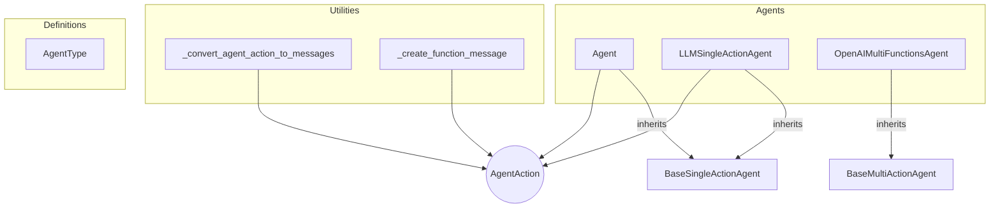

# agent_core Module
This module defines core agent functionalities, including single and multi-action agents, utility functions for agent actions, and an enumeration of agent types.

<!-- DIAGRAM_JSON
{
  "nodes": [
    {"id": "_convert_agent_action_to_messages", "label": "_convert_agent_action_to_messages", "type": "function"},
    {"id": "_create_function_message", "label": "_create_function_message", "type": "function"},
    {"id": "Agent", "label": "Agent", "type": "class"},
    {"id": "LLMSingleActionAgent", "label": "LLMSingleActionAgent", "type": "class"},
    {"id": "AgentType", "label": "AgentType", "type": "enum"},
    {"id": "OpenAIMultiFunctionsAgent", "label": "OpenAIMultiFunctionsAgent", "type": "class"},
    {"id": "AgentAction", "label": "AgentAction", "type": "type", "isExternal": true},
    {"id": "BaseSingleActionAgent", "label": "BaseSingleActionAgent", "type": "class", "isExternal": true},
    {"id": "BaseMultiActionAgent", "label": "BaseMultiActionAgent", "type": "class", "isExternal": true}
  ],
  "edges": [
    {"source": "_convert_agent_action_to_messages", "target": "AgentAction", "label": "uses"},
    {"source": "_create_function_message", "target": "AgentAction", "label": "uses"},
    {"source": "Agent", "target": "BaseSingleActionAgent", "label": "inherits", "type": "inheritance"},
    {"source": "Agent", "target": "AgentAction", "label": "uses"},
    {"source": "LLMSingleActionAgent", "target": "BaseSingleActionAgent", "label": "inherits", "type": "inheritance"},
    {"source": "LLMSingleActionAgent", "target": "AgentAction", "label": "uses"},
    {"source": "OpenAIMultiFunctionsAgent", "target": "BaseMultiActionAgent", "label": "inherits", "type": "inheritance"}
  ],
  "groups": [
    {"id": "Agents", "label": "Agents", "nodes": ["Agent", "LLMSingleActionAgent", "OpenAIMultiFunctionsAgent"]},
    {"id": "Utilities", "label": "Utilities", "nodes": ["_convert_agent_action_to_messages", "_create_function_message"]},
    {"id": "Definitions", "label": "Definitions", "nodes": ["AgentType"]}
  ]
}
-->
```
