# agent_core_classes

**Module Name:** `agent_core_classes`

This module defines the foundational abstract base classes for agents within the classic LangChain framework. It provides the core structures for single-action agents that interact with Language Models (LLMs) and tools to perform tasks, laying the groundwork for more specialized agent implementations.

## Core Components

### `Agent`

`Agent` is a robust abstract base class for agents that leverage an `LLMChain` to determine actions. It's designed for agents requiring an "agent_scratchpad" within their prompt to manage intermediate thoughts and observations during a multi-step reasoning process.

#### Key Responsibilities:

*   **Decision Making:** Uses an `LLMChain` to plan the next action (either a tool call or a final answer).
*   **Scratchpad Management:** Constructs and updates the `agent_scratchpad` to maintain the agent's internal monologue and history of interactions.
*   **Output Parsing:** Employs an `AgentOutputParser` to interpret the LLM's raw output into structured `AgentAction` or `AgentFinish` objects.
*   **Tool Management:** Can restrict tool usage to a specified `allowed_tools` list.
*   **Early Stopping:** Provides mechanisms to handle scenarios where the agent needs to stop early due to iteration or time limits.
*   **Prompt Validation:** Ensures the `LLMChain`'s prompt correctly incorporates the `agent_scratchpad` variable.

#### Key Methods and Properties:

*   `llm_chain`: The `LLMChain` instance driving the agent's decisions.
*   `output_parser`: The `AgentOutputParser` responsible for interpreting LLM outputs.
*   `plan(intermediate_steps, callbacks, **kwargs)`: Synchronously decides the next action based on current steps and inputs.
*   `aplan(intermediate_steps, callbacks, **kwargs)`: Asynchronously decides the next action.
*   `_construct_scratchpad(intermediate_steps)`: Builds the agent's internal thought process string or message list.
*   `get_full_inputs(intermediate_steps, **kwargs)`: Prepares the complete input dictionary for the `LLMChain`.
*   `return_stopped_response(...)`: Handles the agent's response when early stopping criteria are met.
*   `observation_prefix`, `llm_prefix`: Abstract properties defining prefixes for observations and LLM calls in the scratchpad.
*   `create_prompt(tools)`: Abstract class method to create a prompt template specific to the agent and its tools.
*   `_get_default_output_parser()`: Abstract class method to get the default output parser.
*   `from_llm_and_tools(...)`: A class method to construct an `Agent` instance from an `LLM` and a list of `Tools`.

### `LLMSingleActionAgent`

`LLMSingleActionAgent` is a simpler base class for agents that perform a single action based on an `LLMChain`'s output. Unlike `Agent`, it does not explicitly manage an `agent_scratchpad` in its prompt directly but uses `intermediate_steps` as an input key for the `LLMChain`.

#### Key Responsibilities:

*   **Single Action Planning:** Plans a single action using an `LLMChain`.
*   **Output Parsing:** Delegates output interpretation to an `AgentOutputParser`.
*   **Stop Sequences:** Utilizes a list of `stop` sequences to control the LLM's generation.

#### Key Methods and Properties:

*   `llm_chain`: The `LLMChain` instance used for planning.
*   `output_parser`: The `AgentOutputParser` for processing LLM output.
*   `stop`: A list of strings that, when encountered, stop the LLM's generation.
*   `plan(intermediate_steps, callbacks, **kwargs)`: Synchronously plans a single action.
*   `aplan(intermediate_steps, callbacks, **kwargs)`: Asynchronously plans a single action.

## Architecture Diagram

<!-- DIAGRAM_JSON
{
    "direction": "TD",
    "nodes": [
        {"id": "agent_class", "label": "Agent", "type": "component", "link": null},
        {"id": "llm_single_action_agent_class", "label": "LLMSingleActionAgent", "type": "component", "link": null},
        {"id": "base_single_action_agent", "label": "BaseSingleActionAgent", "type": "external", "link": "agent_base_classes.md"},
        {"id": "llm_chain", "label": "LLMChain", "type": "external", "link": "classic_chains_base.md"},
        {"id": "agent_output_parser", "label": "AgentOutputParser", "type": "external", "link": "core_output_parsers.md"},
        {"id": "base_language_model", "label": "BaseLanguageModel", "type": "external", "link": "core_language_models.md"},
        {"id": "base_prompt_template", "label": "BasePromptTemplate", "type": "external", "link": "core_prompts.md"},
        {"id": "prompt_template_types", "label": "PromptTemplate/FewShotPromptTemplate", "type": "external", "link": "core_prompts.md"},
        {"id": "base_tool", "label": "BaseTool", "type": "external", "link": "core_tools.md"},
        {"id": "agent_action_finish", "label": "AgentAction/AgentFinish", "type": "external", "link": "core_agents.md"},
        {"id": "callbacks_manager", "label": "Callbacks/BaseCallbackManager", "type": "external", "link": "core_callbacks.md"},
        {"id": "base_message", "label": "BaseMessage", "type": "external", "link": "core_messages.md"}
    ],
    "edges": [
        {"source": "agent_class", "target": "base_single_action_agent"},
        {"source": "agent_class", "target": "llm_chain"},
        {"source": "agent_class", "target": "agent_output_parser"},
        {"source": "agent_class", "target": "base_language_model"},
        {"source": "agent_class", "target": "base_prompt_template"},
        {"source": "agent_class", "target": "prompt_template_types"},
        {"source": "agent_class", "target": "base_tool"},
        {"source": "agent_class", "target": "agent_action_finish"},
        {"source": "agent_class", "target": "callbacks_manager"},
        {"source": "agent_class", "target": "base_message"},
        {"source": "llm_single_action_agent_class", "target": "base_single_action_agent"},
        {"source": "llm_single_action_agent_class", "target": "llm_chain"},
        {"source": "llm_single_action_agent_class", "target": "agent_output_parser"},
        {"source": "llm_single_action_agent_class", "target": "agent_action_finish"},
        {"source": "llm_single_action_agent_class", "target": "callbacks_manager"}
    ],
    "groups": []
}
-->

```mermaid
graph TD
    agent_class[Agent]
    llm_single_action_agent_class[LLMSingleActionAgent]
    base_single_action_agent[BaseSingleActionAgent]
    llm_chain[LLMChain]
    agent_output_parser[AgentOutputParser]
    base_language_model[BaseLanguageModel]
    base_prompt_template[BasePromptTemplate]
    prompt_template_types[PromptTemplate/FewShotPromptTemplate]
    base_tool[BaseTool]
    agent_action_finish[AgentAction/AgentFinish]
    callbacks_manager[Callbacks/BaseCallbackManager]
    base_message[BaseMessage]

    agent_class --> base_single_action_agent
    agent_class --> llm_chain
    agent_class --> agent_output_parser
    agent_class --> base_language_model
    agent_class --> base_prompt_template
    agent_class --> prompt_template_types
    agent_class --> base_tool
    agent_class --> agent_action_finish
    agent_class --> callbacks_manager
    agent_class --> base_message

    llm_single_action_agent_class --> base_single_action_agent
    llm_single_action_agent_class --> llm_chain
    llm_single_action_agent_class --> agent_output_parser
    llm_single_action_agent_class --> agent_action_finish
    llm_single_action_agent_class --> callbacks_manager
```

## Relationships to Other Modules

This module serves as a foundational layer for agent implementations within the `classic_agents` module. It heavily relies on:

*   [`agent_base_classes`](agent_base_classes.md): Provides the `BaseSingleActionAgent` abstract class that these agents extend.
*   [`classic_chains_base`](classic_chains_base.md): For the `LLMChain` component, which is central to how both `Agent` and `LLMSingleActionAgent` interact with language models.
*   [`core_output_parsers`](core_output_parsers.md): For `AgentOutputParser`, enabling structured interpretation of LLM responses.
*   [`core_language_models`](core_language_models.md): For `BaseLanguageModel`, allowing agents to interface with various LLM types.
*   [`core_prompts`](core_prompts.md): For `BasePromptTemplate` and its concrete implementations (`PromptTemplate`, `FewShotPromptTemplate`), which are used to construct the prompts sent to the LLM.
*   [`core_tools`](core_tools.md): For `BaseTool`, which agents can utilize to interact with external functionalities.
*   [`core_agents`](core_agents.md): For fundamental agent-related types like `AgentAction` and `AgentFinish`, which represent the agent's decided actions or final outputs.
*   [`core_callbacks`](core_callbacks.md): For `Callbacks` and `BaseCallbackManager`, facilitating monitoring and interaction during agent execution.
*   [`core_messages`](core_messages.md): For `BaseMessage`, used in constructing the agent's scratchpad, particularly in the `Agent` class.