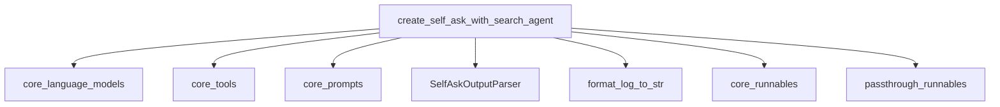

# agent_creation_function

The `agent_creation_function` module provides a specialized function for constructing agents that utilize the "self-ask with search" prompting strategy. This module is a key component within the `self_ask_with_search_agents` system, enabling the creation of intelligent agents capable of breaking down complex questions into follow-up queries and integrating external tools for information retrieval.

## Architecture and Component Relationships

The `agent_creation_function` module's primary component, `create_self_ask_with_search_agent`, orchestrates the assembly of the self-ask with search agent. It integrates various core LangChain components to define the agent's behavior and processing flow.

<!-- DIAGRAM_JSON
{
    "direction": "TD",
    "nodes": [
        {"id": "create_agent", "label": "create_self_ask_with_search_agent", "type": "component", "link": null},
        {"id": "output_parser", "label": "SelfAskOutputParser", "type": "component", "link": null},
        {"id": "format_log", "label": "format_log_to_str", "type": "component", "link": null},
        {"id": "llm_module", "label": "core_language_models", "type": "external", "link": "core_language_models.md"},
        {"id": "tools_module", "label": "core_tools", "type": "external", "link": "core_tools.md"},
        {"id": "prompts_module", "label": "core_prompts", "type": "external", "link": "core_prompts.md"},
        {"id": "runnables_module", "label": "core_runnables", "type": "external", "link": "core_runnables.md"},
        {"id": "passthrough_runnables_module", "label": "passthrough_runnables", "type": "external", "link": "passthrough_runnables.md"}
    ],
    "edges": [
        {"source": "create_agent", "target": "llm_module"},
        {"source": "create_agent", "target": "tools_module"},
        {"source": "create_agent", "target": "prompts_module"},
        {"source": "create_agent", "target": "output_parser"},
        {"source": "create_agent", "target": "format_log"},
        {"source": "create_agent", "target": "runnables_module"},
        {"source": "create_agent", "target": "passthrough_runnables_module"}
    ],
    "groups": []
}
-->


## Core Functionality

### `create_self_ask_with_search_agent`

```python
def create_self_ask_with_search_agent(
    llm: BaseLanguageModel,
    tools: Sequence[BaseTool],
    prompt: BasePromptTemplate,
) -> Runnable:
```

This function is responsible for assembling a "self-ask with search" agent. This type of agent excels at breaking down complex user questions into a series of smaller, actionable follow-up questions. It then uses a designated tool to find "intermediate answers" to these follow-up questions, iteratively building towards a final answer.

-   **`llm`** (`BaseLanguageModel`): The language model that will act as the brain of the agent, generating follow-up questions and synthesizing final answers. Refer to [core_language_models.md](core_language_models.md) for more details on available language models.
-   **`tools`** (`Sequence[BaseTool]`): A list of tools the agent can use. Crucially, for this specific agent type, it *must* contain exactly one tool, and that tool *must* be named `"Intermediate Answer"`. This tool is invoked by the agent to retrieve information for its follow-up questions. Refer to [core_tools.md](core_tools.md) for more information on creating and using tools.
-   **`prompt`** (`BasePromptTemplate`): The prompt template guides the agent's reasoning process. It is mandatory for the prompt to include an input key named `agent_scratchpad`. This key will be populated with the agent's internal thought process, including follow-up questions and intermediate answers. Refer to [core_prompts.md](core_prompts.md) for details on prompt engineering.

**Returns**:

A `Runnable` sequence. This sequence represents the complete agent, which can be invoked with inputs matching the prompt's input variables. The agent will return either an `AgentAction` (indicating a further step) or an `AgentFinish` (providing the final answer). For more about runnables, see [core_runnables.md](core_runnables.md) and [passthrough_runnables.md](passthrough_runnables.md).

**Example Usage**:

```python
from langchain_classic import hub
from langchain_anthropic import ChatAnthropic
from langchain_classic.agents import (
    AgentExecutor,
    create_self_ask_with_search_agent,
)

prompt = hub.pull("hwchase17/self-ask-with-search")
model = ChatAnthropic(model="claude-3-haiku-20240307")
tools = [...]  # Should just be one tool with name `Intermediate Answer`

agent = create_self_ask_with_search_agent(model, tools, prompt)
agent_executor = AgentExecutor(agent=agent, tools=tools)

agent_executor.invoke({"input": "hi"})
```

**Prompt Requirements**:

The provided `prompt` must define an input variable named `agent_scratchpad`. This variable will dynamically contain the agent's internal reasoning and interactions with its tools. An example prompt structure is provided below:

```python
from langchain_core.prompts import PromptTemplate

template = '''Question: Who lived longer, Muhammad Ali or Alan Turing?
Are follow up questions needed here: Yes.
Follow up: How old was Muhammad Ali when he died?
Intermediate answer: Muhammad Ali was 74 years old when he died.
Follow up: How old was Alan Turing when he died?
Intermediate answer: Alan Turing was 41 years old when he died.
So the final answer is: Muhammad Ali

Question: When was the founder of craigslist born?
Are follow up questions needed here: Yes.
Follow up: Who was the founder of craigslist?
Intermediate answer: Craigslist was founded by Craig Newmark.
Follow up: When was Craig Newmark born?
Intermediate answer: Craig Newmark was born on December 6, 1952.
So the final answer is: December 6, 1952

Question: Who was the maternal grandfather of George Washington?
Are follow up questions needed here: Yes.
Follow up: Who was the mother of George Washington?
Intermediate answer: The mother of George Washington was Mary Ball Washington.
Follow up: Who was the father of Mary Ball Washington?
Intermediate answer: The father of Mary Ball Washington was Joseph Ball.
So the final answer is: Joseph Ball

Question: Are both the directors of Jaws and Casino Royale from the same country?
Are follow up questions needed here: Yes.
Follow up: Who is the director of Jaws?
Intermediate answer: The director of Jaws is Steven Spielberg.
Follow up: Where is Steven Spielberg from?
Intermediate answer: The United States.
Follow up: Who is the director of Casino Royale?
Intermediate answer: The director of Casino Royale is Martin Campbell.
Follow up: Where is Martin Campbell from?
Intermediate answer: New Zealand.
So the final answer is: No

Question: {input}
Are followup questions needed here:{agent_scratchpad}'''

prompt = PromptTemplate.from_template(template)
```