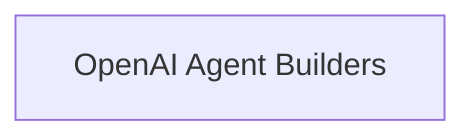

# `agent_creation_functions` Module Documentation

## Introduction

The `agent_creation_functions` module provides a set of utilities and classes for constructing various types of agents, primarily focusing on leveraging OpenAI's advanced capabilities such as function calling and tool usage. This module is a core part of the agent framework, enabling developers to easily instantiate agents with specific interaction patterns and tool integrations.

## Architecture Overview

The `agent_creation_functions` module is structured to provide clear separation of concerns, with specialized components for different agent creation paradigms.

<!-- DIAGRAM_JSON
{
    "direction": "TD",
    "nodes": [
        {"id": "openai_agent_builders", "label": "OpenAI Agent Builders", "type": "module", "link": "openai_agent_builders.md"}
    ],
    "edges": [],
    "groups": []
}
-->

## Sub-modules

### [OpenAI Agent Builders](openai_agent_builders.md)

This sub-module contains functions and classes for constructing various types of agents that leverage OpenAI's function calling and tool-use capabilities, including single-function, multi-function, and tool-based agents. It provides the core logic for integrating OpenAI models with external tools and defining agent behavior.