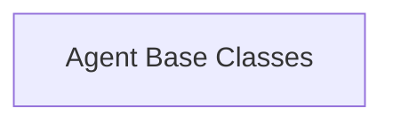

# `agent_definitions` Module Documentation

## Introduction

The `agent_definitions` module in `langchain_classic` provides the foundational abstract base classes for defining and implementing various types of agents. These agents are responsible for deciding what actions to take based on observed input and intermediate steps, often by interacting with a language model.

This module serves as the core framework for building intelligent agents within the LangChain ecosystem, enabling developers to create custom agents with specific behaviors and tool-use capabilities.

## Architecture

The `agent_definitions` module is structured around its core base classes, which are extended by more specialized agent implementations throughout the `classic_agents` module. The primary components define the interface and fundamental logic for agents.

<!-- DIAGRAM_JSON
{
    "direction": "TD",
    "nodes": [
        {"id": "agent_base_classes", "label": "Agent Base Classes", "type": "module", "link": "agent_base_classes.md"}
    ],
    "edges": [],
    "groups": []
}
-->

## Sub-modules

### [Agent Base Classes](agent_base_classes.md)
This sub-module defines the fundamental abstract base classes for agents, including single-action and generic agents. It lays the groundwork for how agents plan, execute actions, and interact with language models and tools.
