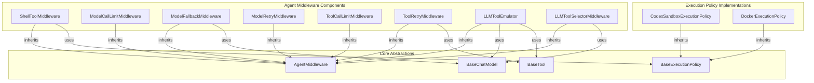

# agent_execution_middleware
This module provides various middleware components for agents, enabling features like shell execution policies, model call limits, model/tool retries, fallbacks, tool emulation, and tool selection.

<!-- DIAGRAM_JSON
{
  "nodes": [
    {"id": "D", "label": "ShellToolMiddleware"},
    {"id": "E", "label": "ModelCallLimitMiddleware"},
    {"id": "F", "label": "ModelFallbackMiddleware"},
    {"id": "G", "label": "ModelRetryMiddleware"},
    {"id": "H", "label": "ToolCallLimitMiddleware"},
    {"id": "I", "label": "ToolRetryMiddleware"},
    {"id": "J", "label": "LLMToolEmulator"},
    {"id": "K", "label": "LLMToolSelectorMiddleware"},
    {"id": "B", "label": "CodexSandboxExecutionPolicy"},
    {"id": "C", "label": "DockerExecutionPolicy"},
    {"id": "L", "label": "AgentMiddleware"},
    {"id": "M", "label": "BaseExecutionPolicy"},
    {"id": "N", "label": "BaseChatModel"},
    {"id": "O", "label": "BaseTool"}
  ],
  "edges": [
    {"source": "D", "target": "L", "label": "inherits", "type": "inheritance"},
    {"source": "E", "target": "L", "label": "inherits", "type": "inheritance"},
    {"source": "F", "target": "L", "label": "inherits", "type": "inheritance"},
    {"source": "G", "target": "L", "label": "inherits", "type": "inheritance"},
    {"source": "H", "target": "L", "label": "inherits", "type": "inheritance"},
    {"source": "I", "target": "L", "label": "inherits", "type": "inheritance"},
    {"source": "J", "target": "L", "label": "inherits", "type": "inheritance"},
    {"source": "K", "target": "L", "label": "inherits", "type": "inheritance"},
    {"source": "B", "target": "M", "label": "inherits", "type": "inheritance"},
    {"source": "C", "target": "M", "label": "inherits", "type": "inheritance"},
    {"source": "D", "target": "M", "label": "uses", "type": "association"},
    {"source": "F", "target": "N", "label": "uses", "type": "association"},
    {"source": "J", "target": "N", "label": "uses", "type": "association"},
    {"source": "J", "target": "O", "label": "uses", "type": "association"},
    {"source": "K", "target": "N", "label": "uses", "type": "association"},
    {"source": "I", "target": "O", "label": "uses", "type": "association"}
  ],
  "groups": [
    {"id": "agent_middleware_components", "label": "Agent Middleware Components", "nodes": ["D", "E", "F", "G", "H", "I", "J", "K"]},
    {"id": "execution_policy_implementations", "label": "Execution Policy Implementations", "nodes": ["B", "C"]},
    {"id": "core_abstractions", "label": "Core Abstractions", "nodes": ["L", "M", "N", "O"]}
  ]
}
-->
