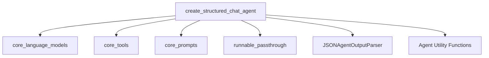

# agent_factory

The `agent_factory` module, specifically focusing on `create_structured_chat_agent`, is responsible for constructing intelligent agents capable of interacting with various tools in a structured chat environment. It facilitates the creation of agents that can parse tool outputs and generate appropriate responses, particularly those requiring multiple inputs or complex interactions.

## Core Functionality

The primary function, `create_structured_chat_agent`, assembles an agent by combining an `LLM`, a set of `tools`, and a predefined `prompt` template. It integrates mechanisms for handling stop sequences and rendering tool descriptions, ensuring the agent operates effectively within the LangChain Classic framework.

## Architecture and Component Relationships

The `agent_factory` module centers around the `create_structured_chat_agent` function, which acts as a factory for structured chat agents. It leverages several core components from both `langchain_core` and `langchain_classic` to build a complete agent runnable.

<!-- DIAGRAM_JSON
{
    "direction": "TD",
    "nodes": [
        {"id": "create_structured_chat_agent", "label": "create_structured_chat_agent", "type": "component", "link": null},
        {"id": "core_language_models", "label": "core_language_models", "type": "external", "link": "core_language_models.md"},
        {"id": "core_tools", "label": "core_tools", "type": "external", "link": "core_tools.md"},
        {"id": "core_prompts", "label": "core_prompts", "type": "external", "link": "core_prompts.md"},
        {"id": "runnable_passthrough", "label": "runnable_passthrough", "type": "external", "link": "passthrough_runnables.md"},
        {"id": "json_agent_output_parser", "label": "JSONAgentOutputParser", "type": "external", "link": "classic_output_parsers.md"},
        {"id": "agent_utilities", "label": "Agent Utility Functions", "type": "external", "link": "classic_agents.md"}
    ],
    "edges": [
        {"source": "create_structured_chat_agent", "target": "core_language_models"},
        {"source": "create_structured_chat_agent", "target": "core_tools"},
        {"source": "create_structured_chat_agent", "target": "core_prompts"},
        {"source": "create_structured_chat_agent", "target": "runnable_passthrough"},
        {"source": "create_structured_chat_agent", "target": "json_agent_output_parser"},
        {"source": "create_structured_chat_agent", "target": "agent_utilities"}
    ],
    "groups": []
}
-->

## Module Integration

The `agent_factory` module plays a crucial role within the broader `classic_agents` system by providing a concrete implementation for creating structured chat agents. It relies on foundational components from `langchain_core` for language models, tools, prompts, and runnables. Specifically:

-   It consumes a `BaseLanguageModel` from the [core_language_models](core_language_models.md) module to power the agent's reasoning capabilities.
-   It integrates `BaseTool` instances from the [core_tools](core_tools.md) module, allowing the agent to perform external actions.
-   It utilizes `ChatPromptTemplate` from the [core_prompts](core_prompts.md) module to guide the agent's behavior and response generation.
-   The agent's execution flow is constructed as a `Runnable` sequence, leveraging components like `RunnablePassthrough` from [passthrough_runnables](passthrough_runnables.md) to manage input and output transformations.
-   The `JSONAgentOutputParser` is a critical component for interpreting the LLM's raw output into structured `AgentAction` or `AgentFinish` objects. This parser can be considered a specialized output parser within the [classic_output_parsers](classic_output_parsers.md) domain, tailored for agent interactions.
-   Utility functions for formatting scratchpad and rendering tools, broadly covered by [classic_agents](classic_agents.md) or its sub-modules like `agent_core`, are also implicitly used.

This integration ensures that structured chat agents can be effectively created, configured, and deployed within applications built using LangChain Classic, providing a robust mechanism for tool-augmented conversational AI.
