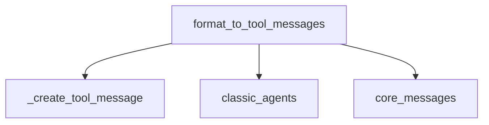

# agent_format_scratchpad

The `agent_format_scratchpad` module is responsible for formatting intermediate steps of an agent's execution into a list of messages suitable for further processing by a language model. This module plays a crucial role in the agent's decision-making loop by transforming raw agent actions and observations into a structured message format that the LLM can understand and use to generate the next action.

## Architecture and Component Relationships

The `agent_format_scratchpad` module contains the core logic for converting agent's operational history into a consumable message format. Its primary function interacts with fundamental agent and message constructs from other modules.

<!-- DIAGRAM_JSON
{
    "direction": "TD",
    "nodes": [
        {"id": "format_to_tool_messages", "label": "format_to_tool_messages", "type": "component", "link": null},
        {"id": "create_tool_message", "label": "_create_tool_message", "type": "component", "link": null},
        {"id": "classic_agents", "label": "classic_agents", "type": "external", "link": "classic_agents.md"},
        {"id": "core_messages", "label": "core_messages", "type": "external", "link": "core_messages.md"}
    ],
    "edges": [
        {"source": "format_to_tool_messages", "target": "create_tool_message"},
        {"source": "format_to_tool_messages", "target": "classic_agents"},
        {"source": "format_to_tool_messages", "target": "core_messages"}
    ],
    "groups": []
}
-->

### Core Components

#### `format_to_tool_messages`

This function is the central piece of this module. It takes a sequence of `(AgentAction, tool output)` tuples, which represent the agent's intermediate steps and observations, and converts them into a list of `BaseMessage` objects. These messages are then used by the language model to determine the next course of action.

-   **Input:** `intermediate_steps` (Sequence of `tuple[AgentAction, str]`) - A record of the agent's actions and the corresponding tool outputs.
-   **Output:** `list[BaseMessage]` - A list of messages, including `ToolMessage` and `AIMessage` objects, formatted for an LLM.

**Key Logic:**
1.  It iterates through each `agent_action` and its `observation` in the `intermediate_steps`.
2.  If the `agent_action` is an instance of `ToolAgentAction`, it constructs `ToolMessage` objects using the `_create_tool_message` helper function, incorporating any existing messages from `agent_action.message_log`.
3.  If the `agent_action` is not a `ToolAgentAction`, it creates an `AIMessage` with the `agent_action.log` as its content.
4.  It ensures that no duplicate messages are added when extending the `messages` list.

**Dependencies:**
-   **`_create_tool_message`**: A private helper function (internal to this module's scope) responsible for creating individual `ToolMessage` instances from an `AgentAction` and its `observation`.
-   **`classic_agents`**: This module depends on definitions like `AgentAction` and `ToolAgentAction` from the [classic_agents](classic_agents.md) module, which are fundamental to representing agent operations.
-   **`core_messages`**: This module relies on core message types such as `BaseMessage` and `AIMessage` from the [core_messages](core_messages.md) module to construct the output for the language model.