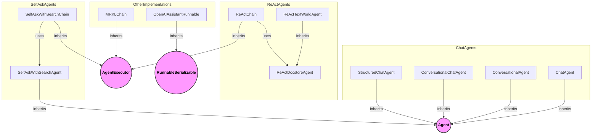

# agent_implementations
This module provides various agent implementations, including conversational, chat-based, ReAct, and self-ask with search agents, alongside specialized chains and an OpenAI Assistant runnable.

<!-- DIAGRAM_JSON
{
  "nodes": [
    {"id": "ChatAgent", "label": "ChatAgent"},
    {"id": "ConversationalAgent", "label": "ConversationalAgent"},
    {"id": "ConversationalChatAgent", "label": "ConversationalChatAgent"},
    {"id": "MRKLChain", "label": "MRKLChain"},
    {"id": "OpenAIAssistantRunnable", "label": "OpenAIAssistantRunnable"},
    {"id": "ReActTextWorldAgent", "label": "ReActTextWorldAgent"},
    {"id": "ReActChain", "label": "ReActChain"},
    {"id": "SelfAskWithSearchAgent", "label": "SelfAskWithSearchAgent"},
    {"id": "SelfAskWithSearchChain", "label": "SelfAskWithSearchChain"},
    {"id": "StructuredChatAgent", "label": "StructuredChatAgent"},
    {"id": "ReActDocstoreAgent", "label": "ReActDocstoreAgent"},
    {"id": "Agent", "label": "Agent", "type": "external"},
    {"id": "AgentExecutor", "label": "AgentExecutor", "type": "external"},
    {"id": "RunnableSerializable", "label": "RunnableSerializable", "type": "external"}
  ],
  "edges": [
    {"source": "ChatAgent", "target": "Agent", "type": "extends"},
    {"source": "ConversationalAgent", "target": "Agent", "type": "extends"},
    {"source": "ConversationalChatAgent", "target": "Agent", "type": "extends"},
    {"source": "MRKLChain", "target": "AgentExecutor", "type": "extends"},
    {"source": "OpenAIAssistantRunnable", "target": "RunnableSerializable", "type": "extends"},
    {"source": "ReActTextWorldAgent", "target": "ReActDocstoreAgent", "type": "extends"},
    {"source": "ReActChain", "target": "AgentExecutor", "type": "extends"},
    {"source": "SelfAskWithSearchAgent", "target": "Agent", "type": "extends"},
    {"source": "SelfAskWithSearchChain", "target": "AgentExecutor", "type": "extends"},
    {"source": "StructuredChatAgent", "target": "Agent", "type": "extends"},
    {"source": "ReActChain", "target": "ReActDocstoreAgent", "type": "uses"},
    {"source": "SelfAskWithSearchChain", "target": "SelfAskWithSearchAgent", "type": "uses"}
  ],
  "groups": [
    {"id": "ChatAgents", "label": "Chat-based Agents", "nodes": ["ChatAgent", "ConversationalAgent", "ConversationalChatAgent", "StructuredChatAgent"]},
    {"id": "ReActAgents", "label": "ReAct Agents", "nodes": ["ReActDocstoreAgent", "ReActTextWorldAgent", "ReActChain"]},
    {"id": "SelfAskAgents", "label": "Self-Ask Agents", "nodes": ["SelfAskWithSearchAgent", "SelfAskWithSearchChain"]},
    {"id": "OtherImplementations", "label": "Other Implementations", "nodes": ["MRKLChain", "OpenAIAssistantRunnable"]}
  ]
}
-->
