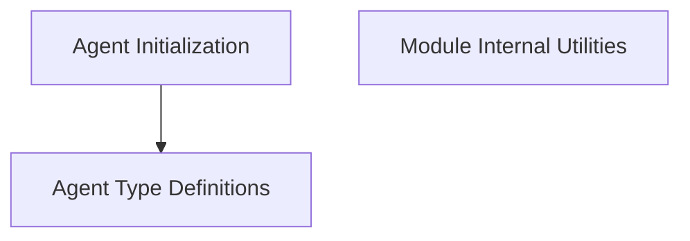

# Agent Management Module

The `agent_management` module is a core component responsible for the definition, initialization, and internal handling of various agent types within the system. It provides the foundational elements for constructing and managing intelligent agents, including their operational parameters and architectural considerations.

## Architecture Overview

The following diagram illustrates the high-level architecture and relationships within the `agent_management` module.

<!-- DIAGRAM_JSON
{
    "direction": "TD",
    "nodes": [
        {"id": "agent_initialization", "label": "Agent Initialization", "type": "module", "link": "agent_initialization.md"},
        {"id": "agent_type_definitions", "label": "Agent Type Definitions", "type": "module", "link": "agent_type_definitions.md"},
        {"id": "module_internals", "label": "Module Internal Utilities", "type": "module", "link": "module_internals.md"}
    ],
    "edges": [
        {"source": "agent_initialization", "target": "agent_type_definitions"}
    ],
    "groups": []
}
-->

## Sub-modules

### [Agent Initialization](agent_initialization.md)
This sub-module focuses on the functions and processes required to initialize various types of agents. It includes the `initialize_agent` function, which serves as a factory for creating agent executors based on provided tools and language models.

### [Agent Type Definitions](agent_type_definitions.md)
This sub-module defines the different categories and characteristics of agents supported by the system. It encompasses the `AgentType` enumeration, which lists the predefined agent types available for use.

### [Module Internal Utilities](module_internals.md)
This sub-module handles the internal workings of the `agent_management` module, specifically concerning attribute access and deprecation warnings. The `__getattr__` component ensures proper handling of module imports and provides guidance on deprecated code paths.