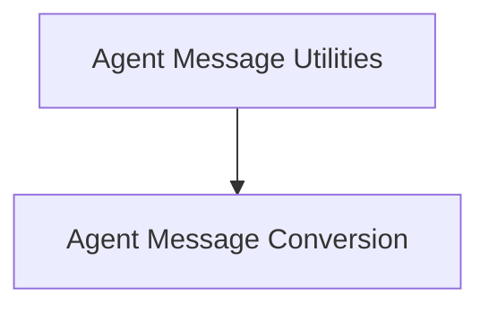

# Agent Message Utilities

## Introduction

The `agent_message_utilities` module provides essential utilities for converting agent actions and observations into standardized message formats. This is crucial for seamless communication and processing within the agent system, ensuring that different components can correctly interpret and react to agent activities.

## Architecture

The `agent_message_utilities` module is structured around its core responsibility of message conversion. It currently contains one primary sub-module:

<!-- DIAGRAM_JSON
{
    "direction": "TD",
    "nodes": [
        {"id": "agent_message_utilities", "label": "Agent Message Utilities", "type": "module"},
        {"id": "message_conversion", "label": "Agent Message Conversion", "type": "module", "link": "message_conversion.md"}
    ],
    "edges": [
        {"source": "agent_message_utilities", "target": "message_conversion"}
    ],
    "groups": []
}
-->

## Sub-modules

### [Agent Message Conversion](message_conversion.md)
This sub-module focuses on the transformation of agent actions and observations into appropriate `BaseMessage` types, such as `AIMessage` and `FunctionMessage`. It includes functions like `_convert_agent_action_to_messages` for reconstructing AI messages from agent actions and `_create_function_message` for generating function messages from tool invocations and their observations.
