# agent_middleware
The `agent_middleware` module offers various middleware components for LangChain agents, providing state-based and filesystem-based tools, file search, and Anthropic prompt caching.

<!-- DIAGRAM_JSON
{
    "nodes": [
        {
            "id": "StateClaudeTextEditorMiddleware",
            "label": "StateClaudeTextEditorMiddleware",
            "description": "State-based text editor tool middleware."
        },
        {
            "id": "StateClaudeMemoryMiddleware",
            "label": "StateClaudeMemoryMiddleware",
            "description": "State-based memory tool middleware."
        },
        {
            "id": "FilesystemClaudeTextEditorMiddleware",
            "label": "FilesystemClaudeTextEditorMiddleware",
            "description": "Filesystem-based text editor tool middleware."
        },
        {
            "id": "FilesystemClaudeMemoryMiddleware",
            "label": "FilesystemClaudeMemoryMiddleware",
            "description": "Filesystem-based memory tool middleware."
        },
        {
            "id": "StateFileSearchMiddleware",
            "label": "StateFileSearchMiddleware",
            "description": "Provides Glob and Grep search over state-based files."
        },
        {
            "id": "AnthropicPromptCachingMiddleware",
            "label": "AnthropicPromptCachingMiddleware",
            "description": "Prompt Caching Middleware."
        },
        {
            "id": "_StateClaudeFileToolMiddleware",
            "label": "_StateClaudeFileToolMiddleware",
            "description": "Base class for state-based file tools."
        },
        {
            "id": "_FilesystemClaudeFileToolMiddleware",
            "label": "_FilesystemClaudeFileToolMiddleware",
            "description": "Base class for filesystem-based file tools."
        },
        {
            "id": "AgentMiddleware",
            "label": "AgentMiddleware",
            "description": "Base class for agent middleware."
        },
        {
            "id": "AnthropicToolsState",
            "label": "AnthropicToolsState",
            "description": "State schema for Anthropic tools."
        },
        {
            "id": "ChatAnthropic",
            "label": "ChatAnthropic",
            "description": "Anthropic chat model."
        }
    ],
    "edges": [
        {
            "source": "StateClaudeTextEditorMiddleware",
            "target": "_StateClaudeFileToolMiddleware",
            "label": "inherits"
        },
        {
            "source": "StateClaudeMemoryMiddleware",
            "target": "_StateClaudeFileToolMiddleware",
            "label": "inherits"
        },
        {
            "source": "FilesystemClaudeTextEditorMiddleware",
            "target": "_FilesystemClaudeFileToolMiddleware",
            "label": "inherits"
        },
        {
            "source": "FilesystemClaudeMemoryMiddleware",
            "target": "_FilesystemClaudeFileToolMiddleware",
            "label": "inherits"
        },
        {
            "source": "StateFileSearchMiddleware",
            "target": "AgentMiddleware",
            "label": "inherits"
        },
        {
            "source": "AnthropicPromptCachingMiddleware",
            "target": "AgentMiddleware",
            "label": "inherits"
        },
        {
            "source": "StateFileSearchMiddleware",
            "target": "AnthropicToolsState",
            "label": "uses"
        },
        {
            "source": "AnthropicPromptCachingMiddleware",
            "target": "ChatAnthropic",
            "label": "interacts with"
        }
    ],
    "groups": [
        {
            "id": "state_file_tools",
            "label": "State-based File Tools",
            "nodes": [
                "StateClaudeTextEditorMiddleware",
                "StateClaudeMemoryMiddleware"
            ]
        },
        {
            "id": "filesystem_file_tools",
            "label": "Filesystem-based File Tools",
            "nodes": [
                "FilesystemClaudeTextEditorMiddleware",
                "FilesystemClaudeMemoryMiddleware"
            ]
        },
        {
            "id": "other_middleware",
            "label": "Other Middleware",
            "nodes": [
                "StateFileSearchMiddleware",
                "AnthropicPromptCachingMiddleware"
            ]
        }
    ]
}
-->

```mermaid
flowchart TD
    subgraph State-based File Tools
        StateClaudeTextEditorMiddleware["StateClaudeTextEditorMiddleware<br>State-based text editor tool middleware."]
        StateClaudeMemoryMiddleware["StateClaudeMemoryMiddleware<br>State-based memory tool middleware."]
    end

    subgraph Filesystem-based File Tools
        FilesystemClaudeTextEditorMiddleware["FilesystemClaudeTextEditorMiddleware<br>Filesystem-based text editor tool middleware."]
        FilesystemClaudeMemoryMiddleware["FilesystemClaudeMemoryMiddleware<br>Filesystem-based memory tool middleware."]
    end

    subgraph Other Middleware
        StateFileSearchMiddleware["StateFileSearchMiddleware<br>Provides Glob and Grep search over state-based files."]
        AnthropicPromptCachingMiddleware["AnthropicPromptCachingMiddleware<br>Prompt Caching Middleware."]
    end

    _StateClaudeFileToolMiddleware[_StateClaudeFileToolMiddleware<br>Base class for state-based file tools.]
    _FilesystemClaudeFileToolMiddleware[_FilesystemClaudeFileToolMiddleware<br>Base class for filesystem-based file tools.]
    AgentMiddleware[AgentMiddleware<br>Base class for agent middleware.]
    AnthropicToolsState[AnthropicToolsState<br>State schema for Anthropic tools.]
    ChatAnthropic[ChatAnthropic<br>Anthropic chat model.]

    StateClaudeTextEditorMiddleware -->|"inherits"| _StateClaudeFileToolMiddleware
    StateClaudeMemoryMiddleware -->|"inherits"| _StateClaudeFileToolMiddleware
    FilesystemClaudeTextEditorMiddleware -->|"inherits"| _FilesystemClaudeFileToolMiddleware
    FilesystemClaudeMemoryMiddleware -->|"inherits"| _FilesystemClaudeFileToolMiddleware
    StateFileSearchMiddleware -->|"inherits"| AgentMiddleware
    AnthropicPromptCachingMiddleware -->|"inherits"| AgentMiddleware

    StateFileSearchMiddleware -->|"uses"| AnthropicToolsState
    AnthropicPromptCachingMiddleware -->|"interacts with"| ChatAnthropic
```
