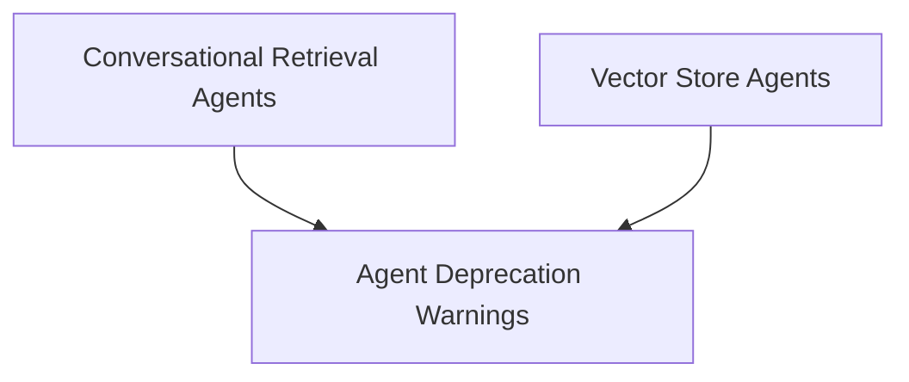

# Agent Toolkits

The `agent_toolkits` module provides a set of utilities and convenience methods for constructing various types of agents within the `langchain_classic.agents` framework. This module aims to simplify the creation of agents tailored for specific tasks, such as conversational retrieval and interaction with vector stores.

## Architecture Overview

The `agent_toolkits` module is composed of several sub-modules, each addressing a distinct aspect of agent construction and management. The relationships between these components are illustrated in the diagram below:

<!-- DIAGRAM_JSON
{
    "direction": "TD",
    "nodes": [
        {"id": "agent_deprecation_warnings", "label": "Agent Deprecation Warnings", "type": "module", "link": "agent_deprecation_warnings.md"},
        {"id": "conversational_retrieval_agents", "label": "Conversational Retrieval Agents", "type": "module", "link": "conversational_retrieval_agents.md"},
        {"id": "vectorstore_agents", "label": "Vector Store Agents", "type": "module", "link": "vectorstore_agents.md"}
    ],
    "edges": [
        {"source": "conversational_retrieval_agents", "target": "agent_deprecation_warnings"},
        {"source": "vectorstore_agents", "target": "agent_deprecation_warnings"}
    ],
    "groups": []
}
-->

## Module Functionality

### [Agent Deprecation Warnings](agent_deprecation_warnings.md)
This sub-module is responsible for handling deprecation warnings when accessing agent toolkits that have been moved to `langchain_experimental`. It ensures that users are notified of changes and provided with guidance on updating their import statements.

### [Conversational Retrieval Agents](conversational_retrieval_agents.md)
This sub-module offers a convenient way to create conversational retrieval agents, particularly those leveraging OpenAI functions. It simplifies the setup of agents that can engage in dialogue and retrieve information from various sources based on the conversation history.

### [Vector Store Agents](vectorstore_agents.md)
The `vectorstore_agents` sub-module provides functionalities for constructing agents that can interact with vector stores. This includes methods for creating agents that query a single vector store, as well as router agents capable of directing queries to multiple vector stores based on relevance.