# agents
This module provides core classes for defining intelligent agents that interact with language models and tools, along with utility functions for managing agent actions and factory methods for creating specialized agent types.

<!-- DIAGRAM_JSON
{
    "nodes": [
        {
            "id": "Agent",
            "label": "Agent",
            "type": "class"
        },
        {
            "id": "LLMSingleActionAgent",
            "label": "LLMSingleActionAgent",
            "type": "class"
        },
        {
            "id": "AgentType",
            "label": "AgentType",
            "type": "enum"
        },
        {
            "id": "create_conversational_retrieval_agent",
            "label": "create_conversational_retrieval_agent",
            "type": "function"
        },
        {
            "id": "create_vectorstore_agent",
            "label": "create_vectorstore_agent",
            "type": "function"
        },
        {
            "id": "create_vectorstore_router_agent",
            "label": "create_vectorstore_router_agent",
            "type": "function"
        },
        {
            "id": "_convert_agent_action_to_messages",
            "label": "_convert_agent_action_to_messages",
            "type": "function"
        },
        {
            "id": "_create_function_message",
            "label": "_create_function_message",
            "type": "function"
        },
        {
            "id": "BaseSingleActionAgent",
            "label": "BaseSingleActionAgent",
            "type": "interface"
        },
        {
            "id": "LLMChain",
            "label": "LLMChain",
            "type": "interface"
        },
        {
            "id": "AgentOutputParser",
            "label": "AgentOutputParser",
            "type": "interface"
        },
        {
            "id": "AgentAction",
            "label": "AgentAction",
            "type": "interface"
        },
        {
            "id": "AgentFinish",
            "label": "AgentFinish",
            "type": "interface"
        },
        {
            "id": "AgentExecutor",
            "label": "AgentExecutor",
            "type": "interface"
        },
        {
            "id": "BaseLanguageModel",
            "label": "BaseLanguageModel",
            "type": "interface"
        },
        {
            "id": "BaseTool",
            "label": "BaseTool",
            "type": "interface"
        },
        {
            "id": "VectorStoreToolkit",
            "label": "VectorStoreToolkit",
            "type": "interface"
        },
        {
            "id": "VectorStoreRouterToolkit",
            "label": "VectorStoreRouterToolkit",
            "type": "interface"
        },
        {
            "id": "BaseMessage",
            "label": "BaseMessage",
            "type": "interface"
        },
        {
            "id": "FunctionMessage",
            "label": "FunctionMessage",
            "type": "interface"
        }
    ],
    "edges": [
        {
            "source": "Agent",
            "target": "BaseSingleActionAgent",
            "type": "inherits"
        },
        {
            "source": "LLMSingleActionAgent",
            "target": "BaseSingleActionAgent",
            "type": "inherits"
        },
        {
            "source": "Agent",
            "target": "LLMChain",
            "type": "uses"
        },
        {
            "source": "Agent",
            "target": "AgentOutputParser",
            "type": "uses"
        },
        {
            "source": "Agent",
            "target": "AgentAction",
            "type": "returns"
        },
        {
            "source": "Agent",
            "target": "AgentFinish",
            "type": "returns"
        },
        {
            "source": "LLMSingleActionAgent",
            "target": "LLMChain",
            "type": "uses"
        },
        {
            "source": "LLMSingleActionAgent",
            "target": "AgentOutputParser",
            "type": "uses"
        },
        {
            "source": "LLMSingleActionAgent",
            "target": "AgentAction",
            "type": "returns"
        },
        {
            "source": "LLMSingleActionAgent",
            "target": "AgentFinish",
            "type": "returns"
        },
        {
            "source": "create_conversational_retrieval_agent",
            "target": "AgentExecutor",
            "type": "creates"
        },
        {
            "source": "create_conversational_retrieval_agent",
            "target": "BaseLanguageModel",
            "type": "uses"
        },
        {
            "source": "create_conversational_retrieval_agent",
            "target": "BaseTool",
            "type": "uses"
        },
        {
            "source": "create_vectorstore_agent",
            "target": "AgentExecutor",
            "type": "creates"
        },
        {
            "source": "create_vectorstore_agent",
            "target": "BaseLanguageModel",
            "type": "uses"
        },
        {
            "source": "create_vectorstore_agent",
            "target": "VectorStoreToolkit",
            "type": "uses"
        },
        {
            "source": "create_vectorstore_router_agent",
            "target": "AgentExecutor",
            "type": "creates"
        },
        {
            "source": "create_vectorstore_router_agent",
            "target": "BaseLanguageModel",
            "type": "uses"
        },
        {
            "source": "create_vectorstore_router_agent",
            "target": "VectorStoreRouterToolkit",
            "type": "uses"
        },
        {
            "source": "_convert_agent_action_to_messages",
            "target": "AgentAction",
            "type": "converts"
        },
        {
            "source": "_convert_agent_action_to_messages",
            "target": "BaseMessage",
            "type": "returns"
        },
        {
            "source": "_create_function_message",
            "target": "AgentAction",
            "type": "converts"
        },
        {
            "source": "_create_function_message",
            "target": "FunctionMessage",
            "type": "returns"
        }
    ],
    "groups": [
        {
            "id": "Core Agent Implementations",
            "label": "Core Agent Implementations",
            "nodes": [
                "Agent",
                "LLMSingleActionAgent"
            ]
        },
        {
            "id": "Agent Creation Functions",
            "label": "Agent Creation Functions",
            "nodes": [
                "create_conversational_retrieval_agent",
                "create_vectorstore_agent",
                "create_vectorstore_router_agent"
            ]
        },
        {
            "id": "Agent Utilities",
            "label": "Agent Utilities",
            "nodes": [
                "_convert_agent_action_to_messages",
                "_create_function_message"
            ]
        },
        {
            "id": "Agent Definitions",
            "label": "Agent Definitions",
            "nodes": [
                "AgentType"
            ]
        }
    ]
}
-->

```mermaid
flowchart TD
    subgraph "Core Agent Implementations"
        Agent["Agent (Class)"]
        LLMSingleActionAgent["LLMSingleActionAgent (Class)"]
    end

    subgraph "Agent Creation Functions"
        create_conversational_retrieval_agent["create_conversational_retrieval_agent (Function)"]
        create_vectorstore_agent["create_vectorstore_agent (Function)"]
        create_vectorstore_router_agent["create_vectorstore_router_agent (Function)"]
    end

    subgraph "Agent Utilities"
        _convert_agent_action_to_messages["_convert_agent_action_to_messages (Function)"]
        _create_function_message["_create_function_message (Function)"]
    end

    subgraph "Agent Definitions"
        AgentType["AgentType (Enum)"]
    end

    %% External Interfaces
    BaseSingleActionAgent[(BaseSingleActionAgent)]
    LLMChain[(LLMChain)]
    AgentOutputParser[(AgentOutputParser)]
    AgentAction[(AgentAction)]
    AgentFinish[(AgentFinish)]
    AgentExecutor[(AgentExecutor)]
    BaseLanguageModel[(BaseLanguageModel)]
    BaseTool[(BaseTool)]
    VectorStoreToolkit[(VectorStoreToolkit)]
    VectorStoreRouterToolkit[(VectorStoreRouterToolkit)]
    BaseMessage[(BaseMessage)]
    FunctionMessage[(FunctionMessage)]

    %% Relationships
    Agent -->|"inherits"| BaseSingleActionAgent
    LLMSingleActionAgent -->|"inherits"| BaseSingleActionAgent

    Agent -- uses --> LLMChain
    Agent -- uses --> AgentOutputParser
    Agent -- returns --> AgentAction
    Agent -- returns --> AgentFinish

    LLMSingleActionAgent -- uses --> LLMChain
    LLMSingleActionAgent -- uses --> AgentOutputParser
    LLMSingleActionAgent -- returns --> AgentAction
    LLMSingleActionAgent -- returns --> AgentFinish

    create_conversational_retrieval_agent -- creates --> AgentExecutor
    create_conversational_retrieval_agent -- uses --> BaseLanguageModel
    create_conversational_retrieval_agent -- uses --> BaseTool

    create_vectorstore_agent -- creates --> AgentExecutor
    create_vectorstore_agent -- uses --> BaseLanguageModel
    create_vectorstore_agent -- uses --> VectorStoreToolkit

    create_vectorstore_router_agent -- creates --> AgentExecutor
    create_vectorstore_router_agent -- uses --> BaseLanguageModel
    create_vectorstore_router_agent -- uses --> VectorStoreRouterToolkit

    _convert_agent_action_to_messages -- converts --> AgentAction
    _convert_agent_action_to_messages -- returns --> BaseMessage

    _create_function_message -- converts --> AgentAction
    _create_function_message -- returns --> FunctionMessage
```
