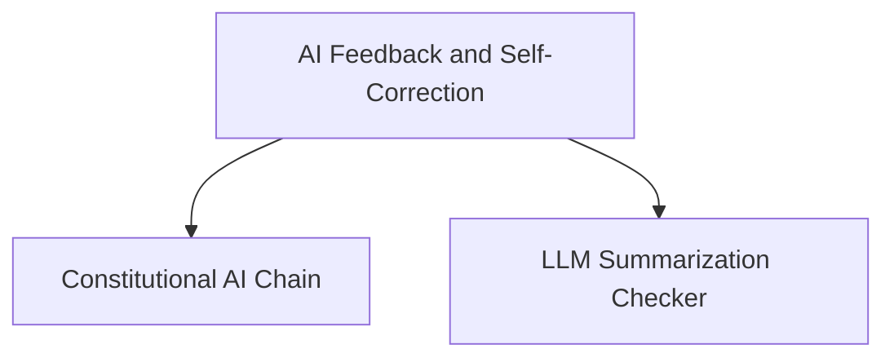

# AI Feedback and Self-Correction Module

## Introduction

The `ai_feedback_and_self_correction` module provides mechanisms for enhancing AI model outputs through automated feedback and self-correction. It includes components designed to apply constitutional principles to responses and to perform self-verification for summarization tasks, leading to more refined and accurate AI-generated content.

## Architecture Overview

The module is composed of two primary sub-modules:

*   **Constitutional AI Chain**: Focuses on applying ethical and performance-based principles to guide response generation.
*   **LLM Summarization Checker**: Specializes in verifying and improving the accuracy of AI-generated summaries through an iterative assertion-checking process.

These sub-modules work together to provide robust feedback loops, enabling AI systems to review, critique, and revise their own outputs.

<!-- DIAGRAM_JSON
{
    "direction": "TD",
    "nodes": [
        {"id": "constitutional_ai_chain", "label": "Constitutional AI Chain", "type": "module", "link": "constitutional_ai_chain.md"},
        {"id": "llm_summarization_checker", "label": "LLM Summarization Checker", "type": "module", "link": "llm_summarization_checker.md"}
    ],
    "edges": [
        {"source": "ai_feedback_and_self_correction", "target": "constitutional_ai_chain"},
        {"source": "ai_feedback_and_self_correction", "target": "llm_summarization_checker"}
    ],
    "groups": []
}
-->

## Sub-modules

### [Constitutional AI Chain](constitutional_ai_chain.md)

This sub-module implements the `ConstitutionalChain` which is designed to apply a set of constitutional principles to an AI model's output. It allows for iterative critique and revision of responses, guided by specific ethical or performance-based rules, ensuring outputs align with desired standards. The documentation provides a deprecated implementation and a suggested replacement using LangGraph.

### [LLM Summarization Checker](llm_summarization_checker.md)

The `LLMSummarizationCheckerChain` sub-module focuses on self-verifying the quality of AI-generated summaries. It works by creating assertions about the summary and then checking if these assertions hold true. If not, the summary is revised. This iterative process aims to improve the factual accuracy and overall quality of summarizations.

