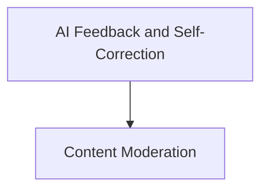

# AI Feedback Chains Module

## Introduction

The `ai_feedback_chains` module provides a set of specialized chains designed for enhancing AI model outputs through feedback, self-correction, and content moderation. These chains enable developers to build more robust and ethical AI applications by integrating mechanisms for refining responses based on constitutional principles, verifying factual consistency, and ensuring adherence to content policies.

## Architecture Overview

The module is composed of two primary sub-modules:

*   **AI Feedback and Self-Correction**: Focuses on mechanisms for an AI to critique and revise its own outputs.
*   **Content Moderation**: Handles the process of filtering or flagging content that violates predefined safety policies.

These sub-modules work together to provide a comprehensive framework for managing and improving AI-generated content within applications.

<!-- DIAGRAM_JSON
{
    "direction": "TD",
    "nodes": [
        {"id": "ai_feedback_and_self_correction", "label": "AI Feedback and Self-Correction", "type": "module", "link": "ai_feedback_and_self_correction.md"},
        {"id": "content_moderation", "label": "Content Moderation", "type": "module", "link": "content_moderation.md"}
    ],
    "edges": [
        {"source": "ai_feedback_and_self_correction", "target": "content_moderation"}
    ],
    "groups": []
}
-->

## Sub-modules

*   ### [AI Feedback and Self-Correction](ai_feedback_and_self_correction.md)
    This sub-module contains chains like `ConstitutionalChain` and `LLMSummarizationCheckerChain` that allow AI models to critique and revise their own responses based on specified principles or assertions. It's crucial for developing self-improving AI systems.

*   ### [Content Moderation](content_moderation.md)
    This sub-module includes the `OpenAIModerationChain`, which provides functionality to check AI-generated or user-provided text against content policies, helping to ensure safe and appropriate interactions. 
