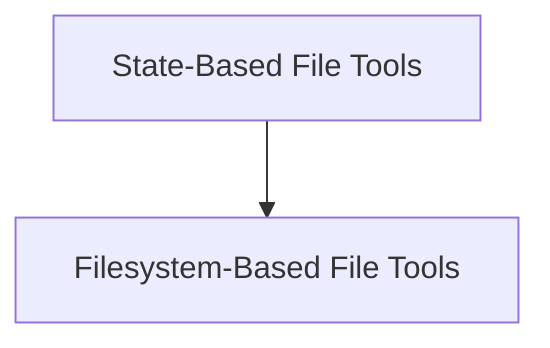

# Anthropic File Tools Module Documentation

## Introduction and Purpose

The `anthropic_file_tools` module provides middleware for integrating Anthropic's `text_editor` and `memory` tools into agents. It offers both state-based and filesystem-based implementations for managing these tools, allowing agents to interact with files either temporarily within a conversation's state or persistently on a local filesystem.

## Architecture Overview

The module is structured around two primary mechanisms for file handling: state-based and filesystem-based. Each mechanism provides implementations for both text editing and memory functionalities, ensuring flexibility in how file interactions are managed and persisted.

<!-- DIAGRAM_JSON
{
    "direction": "TD",
    "nodes": [
        {"id": "state_based_tools", "label": "State-Based File Tools", "type": "module", "link": "state_based_tools.md"},
        {"id": "filesystem_based_tools", "label": "Filesystem-Based File Tools", "type": "module", "link": "filesystem_based_tools.md"}
    ],
    "edges": [
        {"source": "state_based_tools", "target": "filesystem_based_tools"}
    ],
    "groups": []
}
-->

## High-Level Functionality

### [State-Based File Tools](state_based_tools.md)
This sub-module provides Anthropic's `text_editor` and `memory` tools, utilizing LangGraph's state for temporary file storage within a conversation thread.

### [Filesystem-Based File Tools](filesystem_based_tools.md)
This sub-module implements Anthropic's `text_editor` and `memory` tools, persisting file changes directly to the local filesystem for external management.
