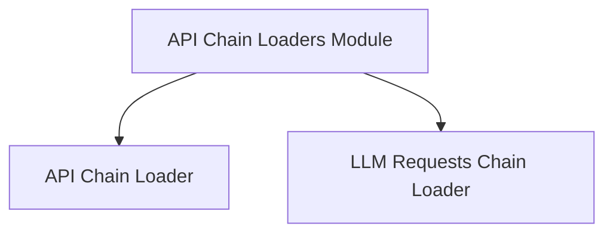

# API Chain Loaders Module

The `api_chain_loaders` module within the classic LangChain framework is responsible for dynamically loading and configuring various API-related chains. It facilitates the integration of external API interactions with language model processing, providing a flexible way to define and utilize complex API calling patterns.

## Architecture Overview

This module acts as a central point for instantiating API-driven chains based on provided configurations. It orchestrates the creation of specialized chains by loading their components and integrating necessary utilities like request wrappers.

<!-- DIAGRAM_JSON
{
    "direction": "TD",
    "nodes": [
        {"id": "api_chain_loaders_module", "label": "API Chain Loaders Module", "type": "module"},
        {"id": "api_chain_loader", "label": "API Chain Loader", "type": "module", "link": "api_chain_loader.md"},
        {"id": "llm_requests_chain_loader", "label": "LLM Requests Chain Loader", "type": "module", "link": "llm_requests_chain_loader.md"}
    ],
    "edges": [
        {"source": "api_chain_loaders_module", "target": "api_chain_loader"},
        {"source": "api_chain_loaders_module", "target": "llm_requests_chain_loader"}
    ],
    "groups": []
}
-->

## Sub-modules

### [API Chain Loader](api_chain_loader.md)
This sub-module focuses on loading and configuring `APIChain` instances. It assembles an API interaction workflow by combining a request chain, an answer chain, and a requests wrapper.

### [LLM Requests Chain Loader](llm_requests_chain_loader.md)
This sub-module is responsible for loading and configuring `LLMRequestsChain` instances. It integrates the capabilities of a language model (LLM) with API request functionalities, using an LLM chain and a requests wrapper to handle dynamic API calls based on LLM outputs.