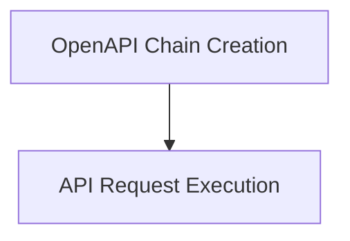

# API Interaction Module Documentation

## Introduction

The `api_interaction` module provides functionalities for interacting with APIs defined by OpenAPI specifications, primarily leveraging OpenAI's function-calling models. It enables the creation of intelligent agents that can understand API schemas and make appropriate calls based on user queries.

## Architecture Overview

The module is structured into two main sub-modules:

1.  **[OpenAPI Chain Creation](chain_creation.md)**: Responsible for setting up the language model chain, including parsing OpenAPI specifications and configuring the LLM with relevant functions.
2.  **[API Request Execution](api_execution.md)**: Handles the actual execution of API requests generated by the language model chain.

These sub-modules work together to translate natural language requests into structured API calls and execute them, providing a seamless way to integrate external services into AI applications.

<!-- DIAGRAM_JSON
{
    "direction": "TD",
    "nodes": [
        {"id": "chain_creation", "label": "OpenAPI Chain Creation", "type": "module", "link": "chain_creation.md"},
        {"id": "api_execution", "label": "API Request Execution", "type": "module", "link": "api_execution.md"}
    ],
    "edges": [
        {"source": "chain_creation", "target": "api_execution"}
    ],
    "groups": []
}
-->

