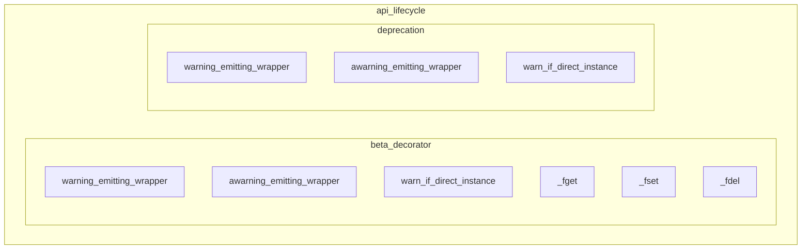

# api_lifecycle
This module provides decorators and property wrappers for managing the lifecycle of API components, specifically for emitting warnings related to beta features and deprecations.

<!-- DIAGRAM_JSON
{
  "nodes": [
    {"id": "BETA_WARN_WRAPPER", "label": "warning_emitting_wrapper"},
    {"id": "BETA_AWARN_WRAPPER", "label": "awarning_emitting_wrapper"},
    {"id": "BETA_WARN_INSTANCE", "label": "warn_if_direct_instance"},
    {"id": "BETA_FGET", "label": "_fget"},
    {"id": "BETA_FSET", "label": "_fset"},
    {"id": "BETA_FDEL", "label": "_fdel"},
    {"id": "DEPREC_WARN_WRAPPER", "label": "warning_emitting_wrapper"},
    {"id": "DEPREC_AWARN_WRAPPER", "label": "awarning_emitting_wrapper"},
    {"id": "DEPREC_WARN_INSTANCE", "label": "warn_if_direct_instance"}
  ],
  "edges": [],
  "groups": [
    {
      "id": "beta_decorator",
      "label": "beta_decorator",
      "nodes": ["BETA_WARN_WRAPPER", "BETA_AWARN_WRAPPER", "BETA_WARN_INSTANCE", "BETA_FGET", "BETA_FSET", "BETA_FDEL"]
    },
    {
      "id": "deprecation",
      "label": "deprecation",
      "nodes": ["DEPREC_WARN_WRAPPER", "DEPREC_AWARN_WRAPPER", "DEPREC_WARN_INSTANCE"]
    },
    {
      "id": "api_lifecycle",
      "label": "api_lifecycle",
      "groups": ["beta_decorator", "deprecation"]
    }
  ]
}
-->
