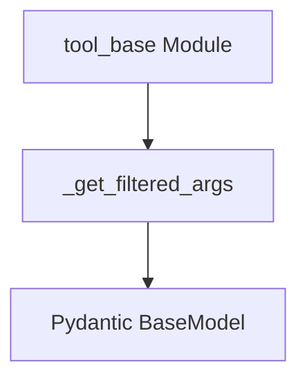

# argument_filtering Module Documentation

The `argument_filtering` module, part of the `core_tools.tool_base` package, provides core functionality for extracting and filtering arguments from a function's signature to generate a Pydantic-compatible schema. This is crucial for dynamically defining the input structure of tools, ensuring that agents can correctly understand and utilize them.

## Purpose and Core Functionality

The primary purpose of this module is to facilitate the creation of robust tool definitions by programmatically determining the expected arguments for a given function. It allows for the exclusion of specific arguments (e.g., internal parameters like `self`, `cls`, or callback managers) and handles the inclusion of "injected" arguments, which might be automatically provided by the system rather than directly by the user. This ensures that the generated schema accurately reflects the tool's public interface.

The core functionality is encapsulated in the `_get_filtered_args` function.

### `_get_filtered_args`

```python
def _get_filtered_args(
    inferred_model: type[BaseModel],
    func: Callable,
    *,
    filter_args: Sequence[str],
    include_injected: bool = True,
) -> dict:
    """Get filtered arguments from a function's signature.

    Args:
        inferred_model: The Pydantic model inferred from the function.
        func: The function to extract arguments from.
        filter_args: Arguments to exclude from the result.
        include_injected: Whether to include injected arguments.

    Returns:
        Dictionary of filtered arguments with their schema definitions.
    """
    schema = inferred_model.model_json_schema()["properties"]
    valid_keys = signature(func).parameters
    return {
        k: schema[k]
        for i, (k, param) in enumerate(valid_keys.items())
        if k not in filter_args
        and (i > 0 or param.name not in {"self", "cls"})
        and (include_injected or not _is_injected_arg_type(param.annotation))
    }
```

This function takes an inferred Pydantic model (representing the function's full signature), the function itself, a list of arguments to filter out, and a flag to control the inclusion of injected arguments. It then returns a dictionary mapping argument names to their schema definitions, effectively creating a clean and focused input schema for a tool.

## Architecture and Component Relationships

The `argument_filtering` module is a leaf module nested within `core_tools.tool_base`. Its main function, `_get_filtered_args`, plays a crucial role in constructing the argument schema for tools, which is a fundamental aspect of how tools are defined and consumed by agents in the LangChain ecosystem.

<!-- DIAGRAM_JSON
{
    "direction": "TD",
    "nodes": [
        {"id": "get_filtered_args", "label": "_get_filtered_args", "type": "component", "link": null},
        {"id": "pydantic_basemodel", "label": "Pydantic BaseModel", "type": "external", "link": null},
        {"id": "tool_base", "label": "tool_base Module", "type": "external", "link": "tool_base.md"}
    ],
    "edges": [
        {"source": "get_filtered_args", "target": "pydantic_basemodel"},
        {"source": "tool_base", "target": "get_filtered_args"}
    ],
    "groups": []
}
-->


### Dependencies:

*   **Pydantic (`BaseModel`)**: The `_get_filtered_args` function heavily relies on Pydantic's `BaseModel` for inferring and extracting argument schemas. Pydantic is an external library used for data validation and settings management.
*   **`tool_base` Module**: This module is contained within `tool_base`, indicating a strong functional relationship. `tool_base` likely orchestrates the overall tool definition process, where argument filtering is a specific step. Refer to the [tool_base module documentation](tool_base.md) for more details.
*   **Python's `inspect` module**: Used for introspecting function signatures (`signature`).

## How it Fits into the Overall System

The `argument_filtering` module is a foundational utility within the tool definition process. When a developer creates a custom tool, the system needs to understand what arguments that tool expects. This module provides the mechanism to precisely define that schema, excluding any internal or framework-specific parameters, and ensuring that only relevant arguments are exposed. This filtered schema is then used by agents to correctly invoke tools and by validation layers to ensure proper input. It contributes to the robustness and usability of the entire LangChain tool ecosystem by providing clear and accurate tool argument specifications.
