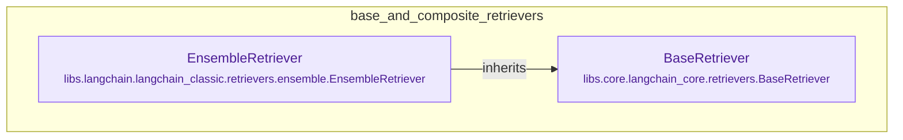

# base_and_composite_retrievers
This module defines the abstract `BaseRetriever` for document retrieval and the `EnsembleRetriever` which combines multiple retrievers using rank fusion.

<!-- DIAGRAM_JSON
{
  "nodes": [
    {
      "id": "BaseRetriever",
      "label": "BaseRetriever",
      "type": "class",
      "path": "libs.core.langchain_core.retrievers.BaseRetriever"
    },
    {
      "id": "EnsembleRetriever",
      "label": "EnsembleRetriever",
      "type": "class",
      "path": "libs.langchain.langchain_classic.retrievers.ensemble.EnsembleRetriever"
    }
  ],
  "edges": [
    {
      "source": "EnsembleRetriever",
      "target": "BaseRetriever",
      "type": "inherits"
    }
  ],
  "groups": [
    {
      "id": "base_and_composite_retrievers",
      "label": "base_and_composite_retrievers",
      "contains": [
        "BaseRetriever",
        "EnsembleRetriever"
      ]
    }
  ]
}
-->
