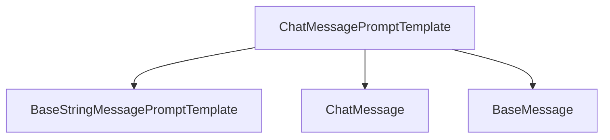

# base_chat_message_template

The `base_chat_message_template` module provides foundational components for constructing chat message prompts within the LangChain Core framework. Its primary role is to define how individual messages, with specific roles, are formatted and integrated into a larger chat prompt.

## Architecture

The core component of this module is `ChatMessagePromptTemplate`, which extends the functionality of basic prompt templates to cater specifically to chat-based interactions by associating a role (e.g., "human", "AI", "system") with the message content.

<!-- DIAGRAM_JSON
{
    "direction": "TD",
    "nodes": [
        {"id": "chat_message_prompt_template", "label": "ChatMessagePromptTemplate", "type": "component", "link": null},
        {"id": "base_string_message_prompt_template", "label": "BaseStringMessagePromptTemplate", "type": "external", "link": "prompt_templates_base.md"},
        {"id": "chat_message", "label": "ChatMessage", "type": "external", "link": "core_messages.md"},
        {"id": "base_message", "label": "BaseMessage", "type": "external", "link": "core_messages.md"}
    ],
    "edges": [
        {"source": "chat_message_prompt_template", "target": "base_string_message_prompt_template"},
        {"source": "chat_message_prompt_template", "target": "chat_message"},
        {"source": "chat_message_prompt_template", "target": "base_message"}
    ],
    "groups": []
}
-->

## Component Details

### ChatMessagePromptTemplate

`ChatMessagePromptTemplate` is a specialized prompt template designed for creating individual chat messages. It inherits from `BaseStringMessagePromptTemplate` and is responsible for taking a prompt and a designated role (e.g., "human", "AI", "system") and formatting them into a `ChatMessage` object.

**Key Features:**

-   **Role Assignment**: Explicitly assigns a `role` to the generated chat message, which is crucial for distinguishing messages from different participants in a conversation.
-   **Content Formatting**: Utilizes an internal prompt (inherited from `BaseStringMessagePromptTemplate`) to format the message content dynamically using provided keyword arguments.
-   **Message Generation**: Produces `ChatMessage` instances, which are a concrete implementation of `BaseMessage`, suitable for use in conversational AI systems.
-   **Asynchronous Support**: Provides both synchronous (`format`) and asynchronous (`aformat`) methods for formatting messages, allowing for flexible integration into various application architectures.

**Relationships:**

-   **Inherits from**: [`BaseStringMessagePromptTemplate`](prompt_templates_base.md)
-   **Creates**: [`ChatMessage`](core_messages.md) instances
-   **Returns**: [`BaseMessage`](core_messages.md) instances (as `ChatMessage` objects)

## Module Integration

The `base_chat_message_template` module is a fundamental part of the `core_prompts` system, specifically within the `chat_prompt_templates` sub-module. It provides the building block for creating structured chat prompts, which are then used by language models for conversational interactions.

It depends on the [`core_messages`](core_messages.md) module for its message types (`ChatMessage`, `BaseMessage`) and the [`core_prompts.prompt_templates_base`](prompt_templates_base.md) module for its base prompt template functionality. This integration ensures consistency and reusability across the prompt engineering landscape of the LangChain Core library.