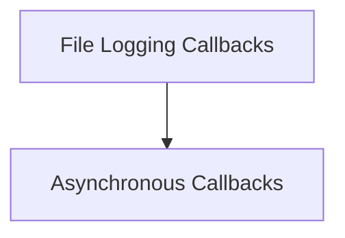

# Base Handlers Module Documentation

## Introduction

The `base_handlers` module provides foundational callback handlers for the LangChain ecosystem. These handlers enable developers to intercept and respond to various events during the execution of LLM (Large Language Model) calls, chains, tools, and agents. This allows for custom logging, monitoring, and integration with external systems.

## Architecture Overview

The `base_handlers` module is composed of two primary sub-modules:

1.  **`async_handlers`**: Defines an asynchronous base class for callback handling.
2.  **`file_handlers`**: Implements a concrete callback handler that writes event logs to a specified file.

The following diagram illustrates the relationship between these sub-modules:

<!-- DIAGRAM_JSON
{
    "direction": "TD",
    "nodes": [
        {"id": "async_handlers", "label": "Asynchronous Callbacks", "type": "module", "link": "async_handlers.md"},
        {"id": "file_handlers", "label": "File Logging Callbacks", "type": "module", "link": "file_handlers.md"}
    ],
    "edges": [
        {"source": "file_handlers", "target": "async_handlers"}
    ],
    "groups": []
}
-->

## Sub-module Functionality

### [Asynchronous Callbacks](async_handlers.md)

The `async_handlers` sub-module defines the `AsyncCallbackHandler` base class. This class provides a set of asynchronous methods that can be overridden to implement custom logic for various events, such as LLM starts and ends, new tokens, chain starts and ends, tool starts and ends, agent actions, and retriever events. It is designed to be extended by developers needing to perform non-blocking operations in response to these events.

### [File Logging Callbacks](file_handlers.md)

The `file_handlers` sub-module provides the `FileCallbackHandler` class, a practical implementation of a callback handler. This handler directs all intercepted events and their associated data to a specified file. It supports both context manager usage for automatic file closing and direct instantiation, making it convenient for logging the execution flow and outputs of LangChain components to a persistent storage location.