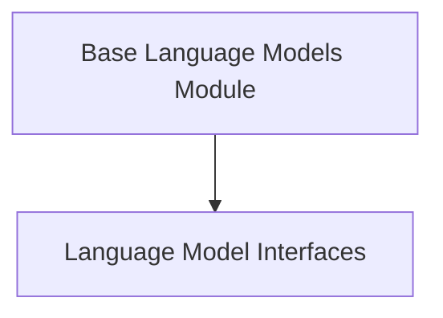

# Base Language Models Module

## Introduction

The `base_language_models` module provides the foundational interfaces and abstract base classes for all language models within the system. It establishes a common contract for interacting with various language model implementations, ensuring consistency in functionality such as prompt generation, caching, and token management. This module is critical for enabling the system to integrate with diverse language models, from simple text completion models to advanced chat models.

## Architecture Overview

The architecture of the `base_language_models` module is centered around defining flexible and extensible interfaces for language models. It primarily consists of core abstract classes that other specific language model implementations extend. This design promotes reusability, modularity, and easy integration of new language models.

<!-- DIAGRAM_JSON
{
    "direction": "TD",
    "nodes": [
        {"id": "language_model_interfaces", "label": "Language Model Interfaces", "type": "module", "link": "language_model_interfaces.md"}
    ],
    "edges": [],
    "groups": []
}
-->

## Sub-modules

### [Language Model Interfaces](language_model_interfaces.md)
This sub-module defines the core abstract base classes, `BaseLanguageModel` and `LLM`, which serve as the foundation for all language model implementations. It establishes common functionalities for prompt generation, caching, and token handling, enabling consistent interaction across different models.
