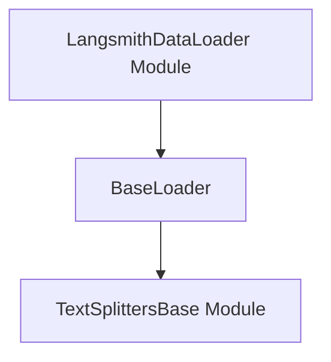

# base_loader_interface Module Documentation

## Introduction

The `base_loader_interface` module defines the foundational abstract interface for all document loaders within the system. It provides a standard set of methods for loading documents, either eagerly or lazily, and includes functionality for splitting documents using text splitters. This module ensures consistency and interoperability across various document loading implementations.

## Architecture and Component Relationships

The core of the `base_loader_interface` module is the `BaseLoader` abstract base class. This class serves as a contract for all concrete document loader implementations, ensuring they adhere to a common loading pattern.

### Core Component: `BaseLoader`

`BaseLoader` is an abstract class that outlines the fundamental operations for loading data into `Document` objects. It encourages lazy loading through generators to optimize memory usage, especially when dealing with large datasets.

**Key methods include:**

*   `load()`: A convenience method that eagerly loads all documents by calling `lazy_load()`. Implementations should override `lazy_load()` rather than `load()` directly.
*   `aload()`: An asynchronous version of `load()`, which uses `alazy_load()`.
*   `lazy_load()`: The primary method that subclasses are expected to implement. It should yield `Document` objects iteratively, allowing for efficient processing without loading all data into memory at once.
*   `alazy_load()`: An asynchronous version of `lazy_load()`.
*   `load_and_split()`: This method loads documents using `load()` and then splits them into smaller chunks using a `TextSplitter` instance. It depends on the [text_splitters_base](text_splitters_base.md) module for text splitting functionalities.

### Relationships

The `BaseLoader` directly interacts with the `text_splitters_base` module, specifically the `TextSplitter` interface and its default implementation `RecursiveCharacterTextSplitter`, to provide document splitting capabilities. Concrete document loaders, such as those found in `langsmith_data_loader`, will inherit from `BaseLoader` and implement its abstract methods.

## How the Module Fits into the Overall System

The `base_loader_interface` module is a critical foundational component within the document processing pipeline. It establishes the standard for how data sources are ingested and converted into `Document` objects, which are then processed by other parts of the system (e.g., for indexing, retrieval, or language model input). By defining a clear interface, it allows for a diverse ecosystem of document loaders to be developed and integrated seamlessly, ensuring that different data formats and sources can be handled consistently.

<!-- DIAGRAM_JSON
{
    "direction": "TD",
    "nodes": [
        {"id": "base_loader", "label": "BaseLoader", "type": "component", "link": null},
        {"id": "text_splitters_base", "label": "TextSplittersBase Module", "type": "external", "link": "text_splitters_base.md"},
        {"id": "langsmith_data_loader", "label": "LangsmithDataLoader Module", "type": "external", "link": "langsmith_data_loader.md"}
    ],
    "edges": [
        {"source": "base_loader", "target": "text_splitters_base"},
        {"source": "langsmith_data_loader", "target": "base_loader"}
    ],
    "groups": []
}
-->

