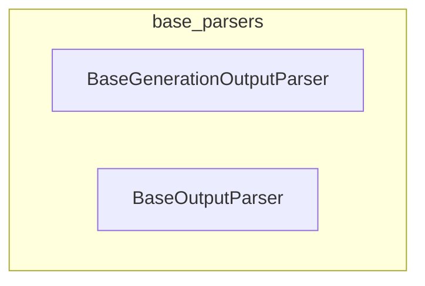

# base_parsers
The `base_parsers` module provides foundational classes for parsing language model outputs. It includes `BaseGenerationOutputParser` for handling generation-specific results and `BaseOutputParser` as a general base for structuring LLM responses.

<!-- DIAGRAM_JSON
{
    "nodes": [
        {
            "id": "BaseGenerationOutputParser",
            "label": "BaseGenerationOutputParser"
        },
        {
            "id": "BaseOutputParser",
            "label": "BaseOutputParser"
        }
    ],
    "edges": [],
    "groups": [
        {
            "id": "base_parsers",
            "label": "base_parsers",
            "nodes": [
                "BaseGenerationOutputParser",
                "BaseOutputParser"
            ]
        }
    ]
}
-->

