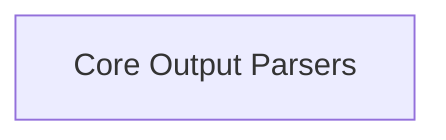

# Base Parsers Module Documentation

The `base_parsers` module provides the fundamental abstract base classes for parsing outputs from Large Language Models (LLMs). It establishes a consistent interface for handling various types of model generations, including raw text and structured chat messages, enabling developers to build custom parsers that integrate seamlessly with the broader system.

## Architecture Overview

The `base_parsers` module acts as the core abstraction layer for output parsing within the `core_output_parsers` system. It defines the contract that all concrete output parsers must adhere to, ensuring interoperability and ease of extension. The module itself contains a single sub-module, `base_output_parsers`, which houses the primary abstract classes.

<!-- DIAGRAM_JSON
{
    "direction": "TD",
    "nodes": [
        {"id": "base_output_parsers", "label": "Core Output Parsers", "type": "module", "link": "base_output_parsers.md"}
    ],
    "edges": [],
    "groups": []
}
-->

## Sub-modules

### [Core Output Parsers](base_output_parsers.md)
This sub-module contains the abstract base classes `BaseGenerationOutputParser` and `BaseOutputParser`, which serve as the foundation for all output parsing logic within the system. These classes define the essential methods for parsing raw LLM generations into structured formats, handling both single string outputs and more complex chat-based interactions.