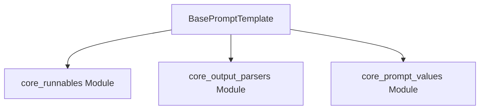

# base_prompt_template_core Module Documentation

## Introduction

The `base_prompt_template_core` module defines the foundational abstract class `BasePromptTemplate`, serving as the blueprint for all prompt templates within the LangChain framework. This module is crucial for establishing a consistent interface for prompt creation, management, and interaction with language models.

## Purpose and Core Functionality

The primary purpose of the `base_prompt_template_core` module is to provide a robust and extensible base for prompt templating. It abstracts away common functionalities such as variable management (input, optional, partial), output parsing, and integration with the runnable interface, allowing concrete prompt template implementations to focus on their specific formatting logic.

Key functionalities include:

*   **Abstract Prompt Definition**: Defines the `BasePromptTemplate` abstract class with core methods for formatting and invoking prompts.
*   **Variable Management**: Handles input variables, optional variables, and partial variables, ensuring all necessary data is available for prompt construction.
*   **Input Validation**: Validates prompt inputs, checking for missing required variables and preventing the use of reserved variable names (e.g., "stop").
*   **Output Parsing Integration**: Allows for the specification of an `BaseOutputParser` to process the output of language model calls.
*   **Runnable Interface Compliance**: Inherits from `RunnableSerializable`, making prompt templates compatible with the LangChain Expression Language (LCEL) for building complex chains.
*   **Serialization**: Provides mechanisms for serialization to and deserialization from dictionary representations, supporting saving and loading of prompt templates.

## Architecture and Component Relationships

The `base_prompt_template_core` module is centered around the `BasePromptTemplate` class. It establishes key dependencies on other core LangChain modules to fulfill its responsibilities.

<!-- DIAGRAM_JSON
{
    "direction": "TD",
    "nodes": [
        {"id": "base_prompt_template", "label": "BasePromptTemplate", "type": "component", "link": null},
        {"id": "core_runnables", "label": "core_runnables Module", "type": "external", "link": "core_runnables.md"},
        {"id": "core_output_parsers", "label": "core_output_parsers Module", "type": "external", "link": "core_output_parsers.md"},
        {"id": "core_prompt_values", "label": "core_prompt_values Module", "type": "external", "link": "core_prompt_values.md"}
    ],
    "edges": [
        {"source": "base_prompt_template", "target": "core_runnables"},
        {"source": "base_prompt_template", "target": "core_output_parsers"},
        {"source": "base_prompt_template", "target": "core_prompt_values"}
    ],
    "groups": []
}
-->

### Relationships:

*   **`BasePromptTemplate`**:
    *   Inherits from `RunnableSerializable` (from [core_runnables.md](core_runnables.md)), enabling prompt templates to be used as runnable components in LCEL.
    *   Uses `BaseOutputParser` (from [core_output_parsers.md](core_output_parsers.md)) to define how the output of a language model call, after being formatted by the prompt, should be parsed.
    *   Returns `PromptValue` instances (such as `StringPromptValue` or `ChatPromptValueConcrete` from [core_prompt_values.md](core_prompt_values.md)) when invoked or formatted, representing the structured input for language models.

## Key Components

### `BasePromptTemplate`

`BasePromptTemplate` is an abstract base class that serves as the foundation for all prompt templates. It defines the common attributes and methods required for any prompt, ensuring consistency across different types of prompts (e.g., string prompts, chat prompts).

**Key Attributes:**

*   `input_variables`: A list of required variable names that the prompt expects.
*   `optional_variables`: A list of optional variable names that the prompt can accept.
*   `input_types`: A dictionary specifying the expected types for input variables.
*   `output_parser`: An optional `BaseOutputParser` instance to process the prompt's output.
*   `partial_variables`: A dictionary of variables that are partially filled, allowing for template reusability with pre-set values.
*   `metadata`: Optional metadata for tracing purposes.
*   `tags`: Optional tags for tracing purposes.

**Key Methods:**

*   `invoke(self, input: dict, config: RunnableConfig | None = None, **kwargs: Any) -> PromptValue`:
    Synchronously invokes the prompt, validating inputs, applying partial variables, and returning a `PromptValue`.
*   `ainvoke(self, input: dict, config: RunnableConfig | None = None, **kwargs: Any) -> PromptValue`:
    Asynchronously invokes the prompt, similar to `invoke`.
*   `format_prompt(self, **kwargs: Any) -> PromptValue` (abstract):
    An abstract method that concrete implementations must override to create a `PromptValue` from the given inputs.
*   `aformat_prompt(self, **kwargs: Any) -> PromptValue`:
    Asynchronously creates a `PromptValue`, defaulting to the synchronous `format_prompt`.
*   `format(self, **kwargs: Any) -> FormatOutputType` (abstract):
    An abstract method for concrete implementations to format the prompt into its final output type (e.g., a string).
*   `aformat(self, **kwargs: Any) -> FormatOutputType`:
    Asynchronously formats the prompt, defaulting to the synchronous `format`.
*   `partial(self, **kwargs: str | Callable[[], str]) -> BasePromptTemplate`:
    Returns a new prompt template instance with some variables partially filled, enabling dynamic prompt construction.
*   `save(self, file_path: Path | str) -> None` (deprecated):
    Saves the prompt template to a specified file path (JSON or YAML format). This method is deprecated in favor of `langchain_core.load.dumpd`/`dumps` for serialization and `load`/`loads` for deserialization.

## How the Module Fits into the Overall System

The `base_prompt_template_core` module is a fundamental building block within the `core_prompts` family, specifically residing under `prompt_templates_base`. It provides the essential abstraction that allows for the creation of various prompt template types (e.g., string prompts, chat prompts, few-shot prompts) while ensuring they all adhere to a common interface.

By defining `BasePromptTemplate` as a `RunnableSerializable`, this module seamlessly integrates with the broader LangChain Expression Language (LCEL). This allows developers to chain prompt templates with language models, output parsers, and other runnables, enabling the construction of sophisticated and modular AI applications.

Concrete implementations of `BasePromptTemplate` leverage its capabilities to define specific prompt structures and formatting logic, such as `StringPromptTemplate` (for simple string-based prompts) and `BaseChatMessageTemplate` (for chat-based prompts), found in sibling modules within `core_prompts`.