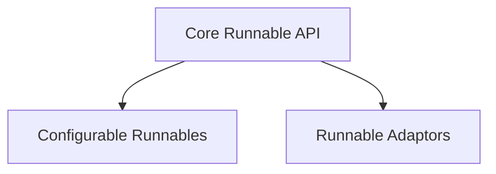

# Base Runnables Module

The `base_runnables` module provides the foundational building blocks for creating composable and configurable units of work within the LangChain Core framework. It defines the core `Runnable` interface, enabling developers to invoke, batch, stream, transform, and compose operations in a declarative manner. This module is essential for building complex chains and agents with robust execution and debugging capabilities.

## Architecture

The `base_runnables` module is structured around a set of core abstract base classes and their serializable extensions, along with utility classes for adapting runnable behavior.

<!-- DIAGRAM_JSON
{
    "direction": "TD",
    "nodes": [
        {"id": "core_runnable_api", "label": "Core Runnable API", "type": "module", "link": "core_runnable_api.md"},
        {"id": "configurable_runnables", "label": "Configurable Runnables", "type": "module", "link": "configurable_runnables.md"},
        {"id": "runnable_adaptors", "label": "Runnable Adaptors", "type": "module", "link": "runnable_adaptors.md"}
    ],
    "edges": [
        {"source": "configurable_runnables", "target": "core_runnable_api"},
        {"source": "runnable_adaptors", "target": "core_runnable_api"}
    ],
    "groups": []
}
-->

## Sub-modules

This module is composed of the following key sub-modules:

### [Core Runnable API](core_runnable_api.md)
This sub-module introduces the `Runnable` abstract base class, which is the cornerstone of the LangChain Expression Language (LCEL). It details how to invoke, batch, and stream operations, as well as how to compose runnables using the `|` operator and the `pipe` method. It also covers essential features like input/output schema inference, configuration binding, error handling with retries and fallbacks, and lifecycle listeners for tracing and debugging.

### [Configurable Runnables](configurable_runnables.md)
Building upon the `Runnable` interface, this sub-module focuses on the `RunnableSerializable` class. It explains how runnables can be serialized and, more importantly, how to make specific fields configurable at runtime using `configurable_fields` and `configurable_alternatives`. This allows for dynamic adjustment of runnable behavior without modifying the underlying code.

### [Runnable Adaptors](runnable_adaptors.md)
This sub-module provides specialized runnable implementations for common patterns. It includes `RunnableEachBase`, which enables applying a runnable to each element of a list, and `RunnableBindingBase`, which facilitates binding arguments and configurations to a runnable, creating new runnables with pre-set parameters. These adaptors enhance the flexibility and reusability of runnables.
