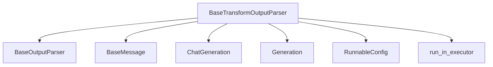

# Module: base_transformation_parsers

## Introduction
The `base_transformation_parsers` module provides the foundational `BaseTransformOutputParser` class, which serves as a base for output parsers capable of handling streaming input. This module is crucial for processing and transforming continuous streams of language model outputs, converting them into a desired format in an efficient and asynchronous manner. It abstracts the complexities of handling both string and `BaseMessage` inputs from language models, making it easier to implement custom streaming parsers.

## Architecture and Component Relationships

The `BaseTransformOutputParser` is the central component of this module. It extends `BaseOutputParser`, inheriting its core parsing capabilities, and adds specific functionalities for stream transformation. It leverages other core modules for message handling, generation types, and runnable configurations.

<!-- DIAGRAM_JSON
{
    "direction": "TD",
    "nodes": [
        {"id": "base_transform_output_parser", "label": "BaseTransformOutputParser", "type": "component", "link": null},
        {"id": "base_output_parser", "label": "BaseOutputParser", "type": "external", "link": "base_output_parsers.md"},
        {"id": "base_message", "label": "BaseMessage", "type": "external", "link": "core_messages.md"},
        {"id": "chat_generation", "label": "ChatGeneration", "type": "external", "link": "core_language_models.md"},
        {"id": "generation", "label": "Generation", "type": "external", "link": "core_language_models.md"},
        {"id": "runnable_config", "label": "RunnableConfig", "type": "external", "link": "core_runnables.md"},
        {"id": "run_in_executor", "label": "run_in_executor", "type": "external", "link": "core_utils.md"}
    ],
    "edges": [
        {"source": "base_transform_output_parser", "target": "base_output_parser"},
        {"source": "base_transform_output_parser", "target": "base_message"},
        {"source": "base_transform_output_parser", "target": "chat_generation"},
        {"source": "base_transform_output_parser", "target": "generation"},
        {"source": "base_transform_output_parser", "target": "runnable_config"},
        {"source": "base_transform_output_parser", "target": "run_in_executor"}
    ],
    "groups": []
}
-->

### Core Components

#### `BaseTransformOutputParser`
- **Description:** This abstract base class provides the fundamental structure for output parsers that can process and transform streaming input. It defines both synchronous (`transform`) and asynchronous (`atransform`) methods for handling iterators of strings or `BaseMessage` objects, yielding transformed outputs of a generic type `T`.
- **Key Methods:**
    - `_transform(self, input: Iterator[str | BaseMessage]) -> Iterator[T]`: An internal synchronous method that iterates through input chunks, parses them (using `parse_result` from the base class), and yields the transformed output. It handles both plain string chunks and `BaseMessage` instances.
    - `_atransform(self, input: AsyncIterator[str | BaseMessage]) -> AsyncIterator[T]`: The asynchronous counterpart to `_transform`, designed for non-blocking stream processing. It uses `run_in_executor` to execute `parse_result` asynchronously.
    - `transform(self, input: Iterator[str | BaseMessage], config: RunnableConfig | None = None, **kwargs: Any) -> Iterator[T]`: The public synchronous method for transforming streaming input. It orchestrates the stream transformation with optional configuration.
    - `atransform(self, input: AsyncIterator[str | BaseMessage], config: RunnableConfig | None = None, **kwargs: Any) -> AsyncIterator[T]`: The public asynchronous method for transforming streaming input, utilizing the `_atransform` method.

## Integration with the Overall System
The `base_transformation_parsers` module is a vital part of the `core_output_parsers` ecosystem, specifically within the `transform_parsers` sub-module. It provides the generic base for all streaming output transformations, ensuring consistency and reusability across different types of streamed data from language models.

It depends on:
- **[base_output_parsers.md](base_output_parsers.md)**: For the foundational `BaseOutputParser` class, providing the `parse_result` method.
- **[core_messages.md](core_messages.md)**: For the `BaseMessage` type, enabling the parser to handle structured message inputs.
- **[core_language_models.md](core_language_models.md)**: For `ChatGeneration` and `Generation` types, which are used to wrap parsed outputs.
- **[core_runnables.md](core_runnables.md)**: For `RunnableConfig`, allowing for configuration of the transformation process.
- **[core_utils.md](core_utils.md)**: For `run_in_executor`, which facilitates asynchronous execution of synchronous parsing logic.

This module is designed to be extended by more specialized transformation parsers, allowing for a modular and flexible approach to processing streamed outputs in the larger system.