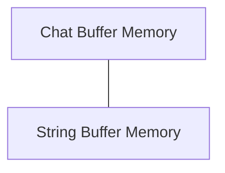

# Basic Buffer Memory Module Documentation

## Introduction

The `basic_buffer_memory` module provides fundamental implementations for storing and managing conversational history within applications. It offers distinct approaches for handling chat messages and general string-based conversations, serving as a core component for memory management in conversational AI systems.

## Architecture Overview

The `basic_buffer_memory` module is composed of two primary sub-modules:

*   **Chat Buffer Memory** (`chat_buffer_memory.md`): Focuses on storing and retrieving conversation history specifically designed for chat-based interactions.
*   **String Buffer Memory** (`string_buffer_memory.md`): Tailored for managing conversation history as a continuous string.

These sub-modules provide flexible options for memory management, catering to different application needs. Both implementations inherit from base memory classes, ensuring consistent interfaces while offering specialized handling of conversation data.

<!-- DIAGRAM_JSON
{
    "direction": "TD",
    "nodes": [
        {"id": "chat_buffer_memory", "label": "Chat Buffer Memory", "type": "module", "link": "chat_buffer_memory.md"},
        {"id": "string_buffer_memory", "label": "String Buffer Memory", "type": "module", "link": "string_buffer_memory.md"}
    ],
    "edges": [
        {"source": "chat_buffer_memory", "target": "string_buffer_memory", "label": "Related Implementations"}
    ],
    "groups": []
}
-->

## Sub-module Functionality

### Chat Buffer Memory ([chat_buffer_memory.md](chat_buffer_memory.md))

This sub-module, primarily implemented by `ConversationBufferMemory`, provides a straightforward way to store the entire conversation history. It can expose the buffer as a list of `BaseMessage` objects or as a single concatenated string, making it versatile for different upstream components that might require either format.

### String Buffer Memory ([string_buffer_memory.md](string_buffer_memory.md))

This sub-module, embodied by `ConversationStringBufferMemory`, is designed for managing conversational history as a plain string. It is particularly useful for scenarios where the conversation context is consumed as a single text block rather than structured chat messages. It ensures that `return_messages` is always `False`, enforcing its string-centric approach.