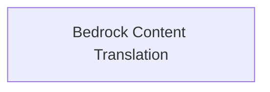

# Bedrock Message Translation Module

The `bedrock_message_translation` module is responsible for translating AI message content and content chunks specifically from Bedrock models into a standardized format within the LangChain Core messaging system.

## Architecture Overview

This module primarily consists of a single sub-module that handles the core translation logic for Bedrock-specific message formats.

<!-- DIAGRAM_JSON
{
    "direction": "TD",
    "nodes": [
        {"id": "bedrock_content_translation", "label": "Bedrock Content Translation", "type": "module", "link": "bedrock_content_translation.md"}
    ],
    "edges": [],
    "groups": []
}
-->

## Sub-modules

### [Bedrock Content Translation](bedrock_content_translation.md)
This sub-module contains the core logic for converting Bedrock `AIMessage` and `AIMessageChunk` objects into a list of standard `ContentBlock` objects. It ensures that messages from Bedrock models, particularly Anthropic models within Bedrock, are correctly parsed and represented in a consistent format for further processing within the LangChain framework.

