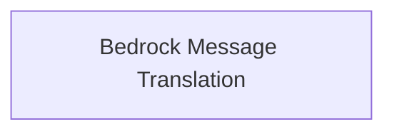

# Bedrock Translators Module Documentation

## Introduction

The `bedrock_translators` module is responsible for translating AI messages and message chunks that contain Bedrock-specific content into a standardized format of content blocks. This ensures interoperability and consistent handling of message content across different AI models and platforms within the system.

## Architecture

This module contains a single sub-module that focuses on the core translation logic for Bedrock messages.

<!-- DIAGRAM_JSON
{
    "direction": "TD",
    "nodes": [
        {"id": "bedrock_message_translation", "label": "Bedrock Message Translation", "type": "module", "link": "bedrock_message_translation.md"}
    ],
    "edges": [],
    "groups": []
}
-->

## Sub-modules

### [Bedrock Message Translation](bedrock_message_translation.md)

This sub-module provides the core functionality for translating AI messages and message chunks with Bedrock-specific content. It includes functions to convert `AIMessage` and `AIMessageChunk` objects into a list of standard `ContentBlock` objects, enabling seamless integration with other parts of the system that expect a standardized message format.