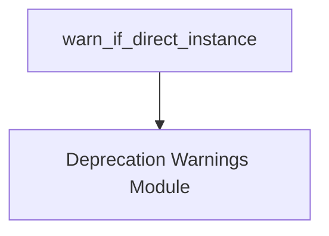

# beta_instance_warnings Module Documentation

## Introduction

The `beta_instance_warnings` module is a specialized component within the `core_api.deprecation_warnings` system. Its primary role is to monitor the instantiation of classes marked as "beta" and to issue warnings when these classes are directly instantiated by external callers. This mechanism helps developers identify and update their code as beta features evolve or are replaced, ensuring a smoother transition and preventing reliance on unstable APIs.

## Architecture and Component Relationships

The `beta_instance_warnings` module is a leaf module, focusing on a single, critical function: `warn_if_direct_instance`. This function acts as a decorator or wrapper, enhancing the behavior of beta class constructors to include a warning mechanism. It leverages utilities from its parent module, `deprecation_warnings`, to determine the caller's origin and to emit the actual warning.

<!-- DIAGRAM_JSON
{
    "direction": "TD",
    "nodes": [
        {"id": "warn_if_direct_instance", "label": "warn_if_direct_instance", "type": "component", "link": null},
        {"id": "deprecation_warnings", "label": "Deprecation Warnings Module", "type": "external", "link": "deprecation_warnings.md"}
    ],
    "edges": [
        {"source": "warn_if_direct_instance", "target": "deprecation_warnings"}
    ],
    "groups": []
}
-->

### Components

#### `warn_if_direct_instance`

This is the core function of the `beta_instance_warnings` module. It is designed to be applied to class constructors (e.g., as a method decorator) to check if the current instance being created is a direct instance of a specified beta class. If it is, and the caller is not an internal system component, a warning is emitted. This ensures that only external users are alerted about beta usage, avoiding internal noise.

- **Purpose**: To detect and warn about direct instantiations of beta classes.
- **Functionality**:
    - Checks if the `self` object is a direct instance of the `obj` (the beta class).
    - Utilizes an internal `warned` flag to ensure the warning is emitted only once per class type.
    - Calls `is_caller_internal()` (likely from `deprecation_warnings.md`) to distinguish between internal and external callers.
    - Calls `emit_warning()` (also likely from `deprecation_warnings.md`) to issue the deprecation warning.

## How it Fits into the Overall System

The `beta_instance_warnings` module is an integral part of the `core_api`'s deprecation management strategy, nested under `deprecation_warnings`. It contributes to API stability and maintainability by proactively informing developers about the use of beta features. By providing early warnings, it encourages timely adoption of stable APIs and helps prevent breaking changes when beta features are modified or removed.

This module directly supports the `deprecation_warnings` module by implementing a specific type of deprecation warning related to class instantiation. It ensures that the lifecycle of beta features is transparent to external users, aligning with best practices for API evolution. For more details on the general deprecation warning mechanisms, refer to the [deprecation_warnings module documentation](deprecation_warnings.md).
