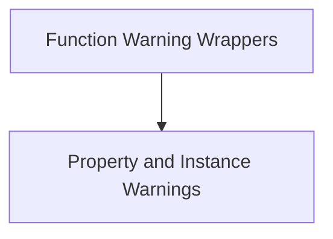

# Beta Warnings Module

## Introduction
The `beta_warnings` module is responsible for managing and emitting warnings for features that are currently in beta. This module ensures that users are appropriately notified when they interact with or directly instantiate components marked as beta, helping to manage expectations and communicate potential API changes. It provides mechanisms for both synchronous and asynchronous function warnings, as well as warnings related to class instantiation and property access.

## Architecture Overview

The `beta_warnings` module is composed of two primary sub-modules: `function_warning_wrappers` and `property_and_instance_warnings`. These sub-modules work in conjunction to provide comprehensive warning capabilities across different types of code interactions.

<!-- DIAGRAM_JSON
{
    "direction": "TD",
    "nodes": [
        {"id": "function_warning_wrappers", "label": "Function Warning Wrappers", "type": "module", "link": "function_warning_wrappers.md"},
        {"id": "property_and_instance_warnings", "label": "Property and Instance Warnings", "type": "module", "link": "property_and_instance_warnings.md"}
    ],
    "edges": [
        {"source": "function_warning_wrappers", "target": "property_and_instance_warnings", "label": "can be used in conjunction with"}
    ],
    "groups": []
}
-->

## Sub-modules

### [Function Warning Wrappers](function_warning_wrappers.md)
This sub-module provides decorators that wrap synchronous and asynchronous functions. These wrappers ensure that a beta warning is emitted the first time a wrapped function is called, preventing repeated warnings during subsequent calls within the same execution context.

### [Property and Instance Warnings](property_and_instance_warnings.md)
This sub-module handles warnings related to the direct instantiation of beta classes and access to beta properties. It includes mechanisms to warn users when they directly create an instance of a beta class or when they attempt to get, set, or delete a property that is marked as beta.
