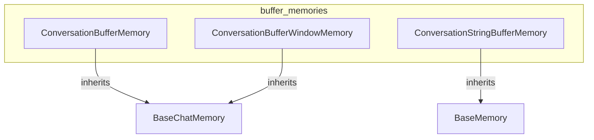

# buffer_memories
The `buffer_memories` module offers various implementations for storing conversation history, including a standard buffer, a string-focused buffer, and a windowed buffer that retains only the most recent interactions.

<!-- DIAGRAM_JSON
{
    "nodes": [
        {
            "id": "ConversationBufferMemory",
            "label": "ConversationBufferMemory",
            "url": "libs.langchain.langchain_classic.memory.buffer.ConversationBufferMemory"
        },
        {
            "id": "ConversationStringBufferMemory",
            "label": "ConversationStringBufferMemory",
            "url": "libs.langchain.langchain_classic.memory.buffer.ConversationStringBufferMemory"
        },
        {
            "id": "ConversationBufferWindowMemory",
            "label": "ConversationBufferWindowMemory",
            "url": "libs.langchain.langchain_classic.memory.buffer_window.ConversationBufferWindowMemory"
        },
        {
            "id": "BaseChatMemory",
            "label": "BaseChatMemory",
            "url": "libs.langchain.langchain_classic.memory.base.BaseChatMemory"
        },
        {
            "id": "BaseMemory",
            "label": "BaseMemory",
            "url": "libs.langchain.langchain_classic.memory.base.BaseMemory"
        }
    ],
    "edges": [
        {
            "source": "ConversationBufferMemory",
            "target": "BaseChatMemory"
        },
        {
            "source": "ConversationStringBufferMemory",
            "target": "BaseMemory"
        },
        {
            "source": "ConversationBufferWindowMemory",
            "target": "BaseChatMemory"
        }
    ],
    "groups": [
        {
            "id": "buffer_memories",
            "label": "buffer_memories",
            "nodes": [
                "ConversationBufferMemory",
                "ConversationStringBufferMemory",
                "ConversationBufferWindowMemory"
            ]
        }
    ]
}
-->
