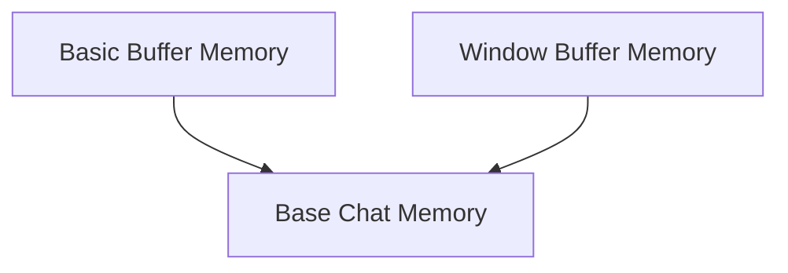

# Buffer Memory Module

The `buffer_memory` module provides various implementations for storing and managing conversation history within language model applications. These memory classes are essential for maintaining context across turns in a conversation, allowing models to refer to past interactions.

## Architecture Overview

The module's architecture is centered around different strategies for buffering chat messages. It builds upon a base chat memory interface and offers both simple buffering and window-based buffering mechanisms. These components work together to provide flexible memory management solutions.

<!-- DIAGRAM_JSON
{
    "direction": "TD",
    "nodes": [
        {"id": "base_chat_memory", "label": "Base Chat Memory", "type": "module", "link": "base_chat_memory.md"},
        {"id": "basic_buffer_memory", "label": "Basic Buffer Memory", "type": "module", "link": "basic_buffer_memory.md"},
        {"id": "window_buffer_memory", "label": "Window Buffer Memory", "type": "module", "link": "window_buffer_memory.md"}
    ],
    "edges": [
        {"source": "basic_buffer_memory", "target": "base_chat_memory"},
        {"source": "window_buffer_memory", "target": "base_chat_memory"}
    ],
    "groups": []
}
-->

## Sub-modules

### [Base Chat Memory](base_chat_memory.md)
This sub-module defines the `BaseChatMemory` abstract class, serving as the foundation for all chat memory implementations. It handles common concerns like input/output key management and provides abstract methods for saving and loading context.

### [Basic Buffer Memory](basic_buffer_memory.md)
The `basic_buffer_memory` sub-module includes `ConversationBufferMemory` and `ConversationStringBufferMemory`. These classes offer straightforward storage of the entire conversation history, either as a list of `BaseMessage` objects or a single concatenated string, respectively.

### [Window Buffer Memory](window_buffer_memory.md)
The `window_buffer_memory` sub-module introduces `ConversationBufferWindowMemory`, an implementation that keeps only the most recent `k` exchanges of a conversation. This is particularly useful for managing context in scenarios with limited memory or context window sizes.
