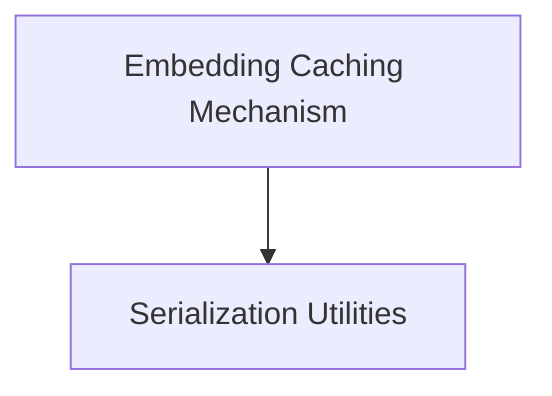

# `cache_backed_embeddings` Module Documentation

This module provides a caching layer for embedding models, allowing for efficient storage and retrieval of previously computed embeddings. It helps reduce redundant computations and improve performance by leveraging a `BaseStore` interface for persistence.

## Architecture

The `cache_backed_embeddings` module is designed with a clear separation of concerns, primarily consisting of the `CacheBackedEmbeddings` class which orchestrates the caching logic, and utility functions for serializing and deserializing embedding values.

<!-- DIAGRAM_JSON
{
    "direction": "TD",
    "nodes": [
        {"id": "embedding_caching", "label": "Embedding Caching Mechanism", "type": "module", "link": "embedding_caching.md"},
        {"id": "serialization_utilities", "label": "Serialization Utilities", "type": "module", "link": "serialization_utilities.md"}
    ],
    "edges": [
        {"source": "embedding_caching", "target": "serialization_utilities"}
    ],
    "groups": []
}
-->

## Module Functionality:

*   **[Embedding Caching Mechanism](embedding_caching.md)**: This sub-module contains the core `CacheBackedEmbeddings` class, which acts as a wrapper around any `Embeddings` model. It intelligently caches document and optionally query embeddings to a provided `BaseStore`, retrieving them when available and computing them only when necessary.
*   **[Serialization Utilities](serialization_utilities.md)**: This sub-module provides essential helper functions (`_value_serializer` and `_value_deserializer`) responsible for converting embedding values (lists of floats) into a byte format suitable for storage and vice-versa.