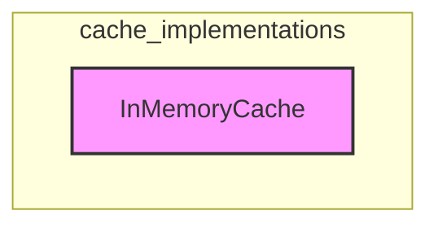

# cache_implementations
This module provides `InMemoryCache`, a simple in-memory key-value store for caching language model outputs based on prompt and LLM configuration strings.

<!-- DIAGRAM_JSON
{
  "nodes": [
    {
      "id": "InMemoryCache",
      "label": "InMemoryCache",
      "metadata": {
        "type": "class",
        "full_name": "libs.core.langchain_core.caches.InMemoryCache"
      }
    }
  ],
  "edges": [],
  "groups": [
    {
      "id": "cache_implementations",
      "label": "cache_implementations",
      "nodes": ["InMemoryCache"]
    }
  ]
}
-->
