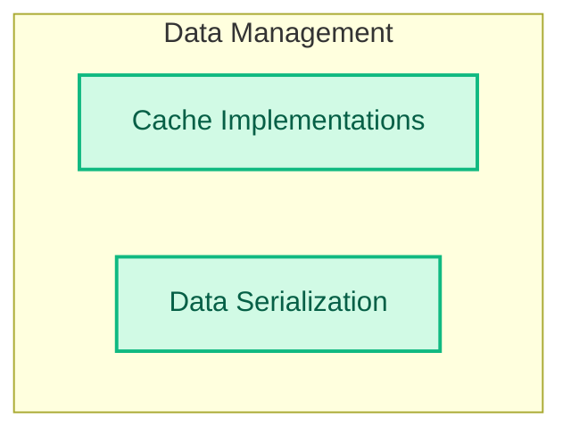

# Caching and Storage
This module provides mechanisms for caching language model responses to enhance performance and includes utilities for serializing and deserializing LangChain objects for persistent storage.

<!-- DIAGRAM_JSON
{
    "direction": "TD",
    "nodes": [
        {
            "id": "caching_and_storage",
            "label": "Caching and Storage",
            "type": "module"
        },
        {
            "id": "cache_implementations",
            "label": "Cache Implementations",
            "type": "module",
            "link": "cache_implementations.md"
        },
        {
            "id": "data_serialization",
            "label": "Data Serialization",
            "type": "module",
            "link": "data_serialization.md"
        }
    ],
    "edges": [],
    "groups": [
        {
            "id": "data_management",
            "label": "Data Management",
            "role": "data",
            "nodes": [
                "cache_implementations",
                "data_serialization"
            ]
        }
    ]
}
-->

