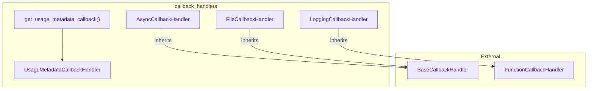

# callback_handlers
The `callback_handlers` module provides various callback implementations for handling events in LangChain applications, including asynchronous, file-based, and logging handlers, along with a utility for tracking usage metadata.

<!-- DIAGRAM_JSON
{
    "nodes": [
        {
            "id": "AsyncCallbackHandler",
            "label": "AsyncCallbackHandler",
            "type": "class"
        },
        {
            "id": "FileCallbackHandler",
            "label": "FileCallbackHandler",
            "type": "class"
        },
        {
            "id": "LoggingCallbackHandler",
            "label": "LoggingCallbackHandler",
            "type": "class"
        },
        {
            "id": "get_usage_metadata_callback",
            "label": "get_usage_metadata_callback",
            "type": "function"
        },
        {
            "id": "BaseCallbackHandler",
            "label": "BaseCallbackHandler",
            "type": "class"
        },
        {
            "id": "FunctionCallbackHandler",
            "label": "FunctionCallbackHandler",
            "type": "class"
        },
        {
            "id": "UsageMetadataCallbackHandler",
            "label": "UsageMetadataCallbackHandler",
            "type": "class"
        }
    ],
    "edges": [
        {
            "source": "AsyncCallbackHandler",
            "target": "BaseCallbackHandler",
            "type": "inherits"
        },
        {
            "source": "FileCallbackHandler",
            "target": "BaseCallbackHandler",
            "type": "inherits"
        },
        {
            "source": "LoggingCallbackHandler",
            "target": "FunctionCallbackHandler",
            "type": "inherits"
        },
        {
            "source": "get_usage_metadata_callback",
            "target": "UsageMetadataCallbackHandler",
            "type": "uses"
        }
    ],
    "groups": [
        {
            "id": "callback_handlers_module",
            "label": "callback_handlers",
            "nodes": [
                "AsyncCallbackHandler",
                "FileCallbackHandler",
                "LoggingCallbackHandler",
                "get_usage_metadata_callback",
                "UsageMetadataCallbackHandler"
            ]
        },
        {
            "id": "external_dependencies",
            "label": "External",
            "nodes": [
                "BaseCallbackHandler",
                "FunctionCallbackHandler"
            ]
        }
    ]
}
-->
