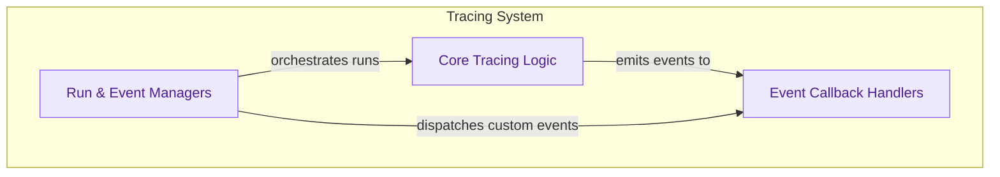

# Callbacks and Tracing
This module provides robust infrastructure for capturing, managing, and reacting to events during the execution of LLM applications, offering capabilities for detailed tracing, custom event dispatch, and various callback mechanisms.

<!-- DIAGRAM_JSON
{
    "direction": "TD",
    "nodes": [
        {"id": "callback_handlers", "label": "Event Callback Handlers", "type": "module", "link": "callback_handlers.md"},
        {"id": "core_tracers", "label": "Core Tracing Logic", "type": "module", "link": "core_tracers.md"},
        {"id": "run_and_event_managers", "label": "Run & Event Managers", "type": "module", "link": "run_and_event_managers.md"}
    ],
    "edges": [
        {"source": "run_and_event_managers", "target": "core_tracers", "label": "orchestrates runs"},
        {"source": "core_tracers", "target": "callback_handlers", "label": "emits events to"},
        {"source": "run_and_event_managers", "target": "callback_handlers", "label": "dispatches custom events"}
    ],
    "groups": [
        {"id": "tracing_system", "label": "Tracing System", "role": "analytical", "nodes": ["callback_handlers", "core_tracers", "run_and_event_managers"]}
    ]
}
-->
