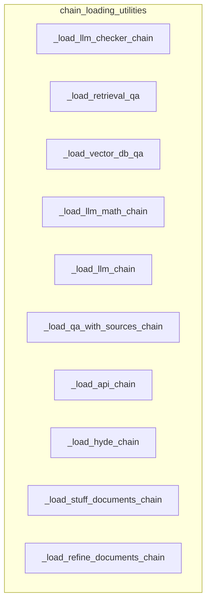

# chain_loading_utilities
This module provides utility functions for loading various LangChain chain types, including LLM, QA, API, and document processing chains, from configuration dictionaries or file paths. It simplifies the instantiation of complex chain structures.

<!-- DIAGRAM_JSON
{
  "nodes": [
    {
      "id": "_load_llm_checker_chain",
      "label": "_load_llm_checker_chain"
    },
    {
      "id": "_load_retrieval_qa",
      "label": "_load_retrieval_qa"
    },
    {
      "id": "_load_vector_db_qa",
      "label": "_load_vector_db_qa"
    },
    {
      "id": "_load_llm_math_chain",
      "label": "_load_llm_math_chain"
    },
    {
      "id": "_load_llm_chain",
      "label": "_load_llm_chain"
    },
    {
      "id": "_load_qa_with_sources_chain",
      "label": "_load_qa_with_sources_chain"
    },
    {
      "id": "_load_api_chain",
      "label": "_load_api_chain"
    },
    {
      "id": "_load_hyde_chain",
      "label": "_load_hyde_chain"
    },
    {
      "id": "_load_stuff_documents_chain",
      "label": "_load_stuff_documents_chain"
    },
    {
      "id": "_load_refine_documents_chain",
      "label": "_load_refine_documents_chain"
    }
  ],
  "edges": [],
  "groups": [
    {
      "id": "chain_loading_utilities",
      "label": "chain_loading_utilities",
      "nodes": [
        "_load_llm_checker_chain",
        "_load_retrieval_qa",
        "_load_vector_db_qa",
        "_load_llm_math_chain",
        "_load_llm_chain",
        "_load_qa_with_sources_chain",
        "_load_api_chain",
        "_load_hyde_chain",
        "_load_stuff_documents_chain",
        "_load_refine_documents_chain"
      ]
    }
  ]
}
-->
