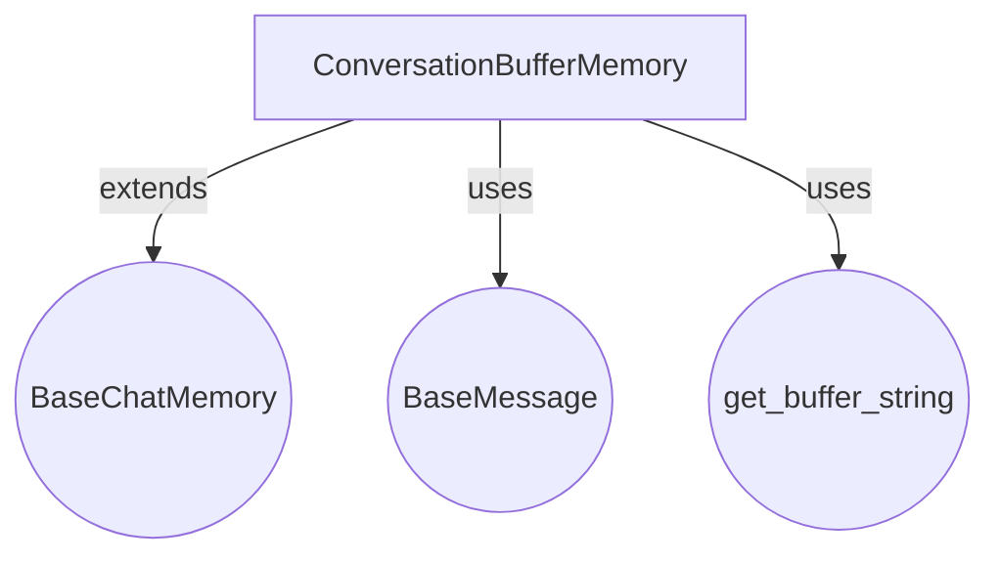

# `chat_buffer_memory`

The `chat_buffer_memory` module provides a straightforward mechanism for storing and retrieving conversational history. It is designed to maintain a complete record of messages exchanged, serving as a foundational component for conversational AI systems that require access to past interactions.

## Core Functionality

The primary component of this module is `ConversationBufferMemory`. This class implements a basic in-memory storage for chat messages, allowing for the conversation history to be retrieved in various formats.

### `ConversationBufferMemory`

*   **Purpose**: To store the entire conversation history as a buffer of messages. It does not perform any advanced processing like summarization or truncation, simply retaining all interactions.
*   **Key Features**:
    *   **Configurable Prefixes**: Allows customization of `human_prefix` (default: "Human") and `ai_prefix` (default: "AI") for formatting messages when retrieved as a string.
    *   **Memory Key**: The conversation history is stored under a configurable `memory_key` (default: "history") within the memory variables.
    *   **Flexible Output**: The stored conversation can be retrieved either as a raw list of `BaseMessage` objects or as a single formatted string, depending on the `return_messages` setting (inherited from `BaseChatMemory`).
    *   **Asynchronous Support**: Provides asynchronous methods (`abuffer`, `abuffer_as_str`, `abuffer_as_messages`, `aload_memory_variables`) for non-blocking operations.

## Architecture and Component Relationships

The `chat_buffer_memory` module's architecture is centered around the `ConversationBufferMemory` class, which extends the `BaseChatMemory` interface to provide its core functionality.

*   **`ConversationBufferMemory`**: This is the concrete implementation within this module. It manages the `chat_memory` (an instance of `BaseChatMessageHistory`) to store messages.
*   **`BaseChatMemory`**: An abstract base class (located in [classic_base_memory](classic_base_memory.md)) that defines the interface for chat memory systems. `ConversationBufferMemory` inherits essential properties and methods from this base class, such as `chat_memory` and `return_messages`.
*   **`BaseMessage`**: Represents a single message in the conversation (defined in [core_messages](core_messages.md)). `ConversationBufferMemory` stores and operates on lists of `BaseMessage` objects.
*   **`get_buffer_string`**: A utility function (likely found within [core_messages](core_messages.md) or a related utility module) responsible for formatting a list of `BaseMessage` objects into a single readable string, incorporating `human_prefix` and `ai_prefix`.

## How the Module Fits into the Overall System

The `chat_buffer_memory` module, specifically `ConversationBufferMemory`, is a fundamental building block in any conversational system that needs to retain context. It is commonly integrated into:

*   **Conversational Chains**: Used by various conversational chains (e.g., `classic_chains_conversational`) to pass the chat history between turns, allowing the language model to respond contextually.
*   **Agents**: Employed by agents (e.g., in `classic_agents`) to keep track of the ongoing dialogue, enabling them to make more informed decisions and generate coherent responses.
*   **Simple Chatbots**: Serves as an easy-to-use memory component for basic chatbots where the entire conversation history needs to be preserved for the duration of the interaction.

It provides a direct, unadulterated view of the conversation, which can then be processed further by other components (e.g., summarization modules, token limit handlers) if the history grows too large for a model's context window.

<!-- DIAGRAM_JSON
{
    "direction": "TD",
    "nodes": [
        {"id": "conversation_buffer_memory", "label": "ConversationBufferMemory", "type": "component", "link": null},
        {"id": "base_chat_memory_ext", "label": "BaseChatMemory", "type": "external", "link": "classic_base_memory.md"},
        {"id": "base_message_ext", "label": "BaseMessage", "type": "external", "link": "core_messages.md"},
        {"id": "get_buffer_string_util", "label": "get_buffer_string", "type": "external", "link": "core_messages.md"}
    ],
    "edges": [
        {"source": "conversation_buffer_memory", "target": "base_chat_memory_ext"},
        {"source": "conversation_buffer_memory", "target": "base_message_ext"},
        {"source": "conversation_buffer_memory", "target": "get_buffer_string_util"}
    ],
    "groups": []
}
-->
