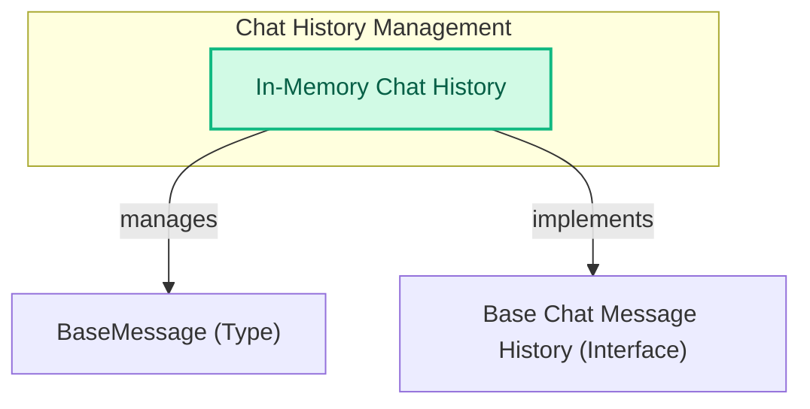

# Chat History Module
This module provides `InMemoryChatMessageHistory`, a concrete implementation for storing and managing chat messages in memory, supporting synchronous and asynchronous operations for adding, retrieving, and clearing message history.
<!-- DIAGRAM_JSON
{
    "direction": "TD",
    "nodes": [
        {"id": "in_memory_history", "label": "In-Memory Chat History", "type": "component", "link": null},
        {"id": "message_types", "label": "BaseMessage (Type)", "type": "external", "link": "messages_and_history.md"},
        {"id": "history_interface", "label": "Base Chat Message History (Interface)", "type": "external", "link": "messages_and_history.md"}
    ],
    "edges": [
        {"source": "in_memory_history", "target": "message_types", "label": "manages"},
        {"source": "in_memory_history", "target": "history_interface", "label": "implements"}
    ],
    "groups": [
        {"id": "chat_history_management", "label": "Chat History Management", "role": "data", "nodes": ["in_memory_history"]}
    ]
}
-->
