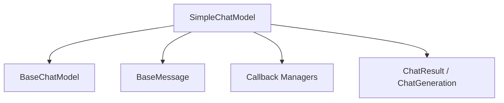

# chat_model_interfaces

## Introduction
This module provides simplified interfaces for chat models, primarily through the `SimpleChatModel` class. It serves as a convenience base class for developers to implement custom chat models with a straightforward synchronous `_call` method, while still conforming to the broader `BaseChatModel` interface.

## Module Purpose and Core Functionality
The `chat_model_interfaces` module is designed to simplify the creation of chat model integrations. Its core functionality revolves around the `SimpleChatModel`, which abstracts away the complexities of handling `ChatResult` and `ChatGeneration` objects, allowing implementers to focus solely on converting a list of `BaseMessage` into a string response.

### `SimpleChatModel`
- **Purpose**: Provides a simplified base class for chat model implementations, particularly for backwards compatibility. New implementations are encouraged to use `BaseChatModel` directly.
- **Core Methods**:
    - `_call(messages, stop, run_manager, **kwargs) -> str`: This is an abstract method that subclasses must implement. It takes a list of `BaseMessage` objects and should return a string representing the chat model's response.
    - `_generate(messages, stop, run_manager, **kwargs) -> ChatResult`: This method is implemented by `SimpleChatModel` and orchestrates the call to the abstract `_call` method. It takes the string output from `_call` and wraps it into an `AIMessage`, then into a `ChatGeneration` and finally a `ChatResult`.
    - `_agenerate(messages, stop, run_manager, **kwargs) -> ChatResult`: Provides an asynchronous version of `_generate` by running the synchronous `_generate` method in an executor.

## Architecture and Component Relationships
This module contains the `SimpleChatModel` which inherits from `BaseChatModel` and relies on several external components for its operation.

## How the Module Fits into the Overall System
The `chat_model_interfaces` module acts as an integration point within the larger language model ecosystem. By providing `SimpleChatModel`, it allows for rapid prototyping and integration of chat models that can be defined by a simple string-in, string-out interface. It ensures that these simpler implementations can still be used wherever a `BaseChatModel` is expected, maintaining compatibility and consistency across the system.

## Diagrams
<!-- DIAGRAM_JSON
{
    "direction": "TD",
    "nodes": [
        {"id": "simple_chat_model", "label": "SimpleChatModel", "type": "component", "link": null},
        {"id": "base_chat_model", "label": "BaseChatModel", "type": "external", "link": "core_language_models.md"},
        {"id": "base_message", "label": "BaseMessage", "type": "external", "link": "core_messages.md"},
        {"id": "callback_managers", "label": "Callback Managers", "type": "external", "link": "core_callbacks.md"},
        {"id": "chat_result_generation", "label": "ChatResult / ChatGeneration", "type": "external", "link": "core_language_models.md"}
    ],
    "edges": [
        {"source": "simple_chat_model", "target": "base_chat_model"},
        {"source": "simple_chat_model", "target": "base_message"},
        {"source": "simple_chat_model", "target": "callback_managers"},
        {"source": "simple_chat_model", "target": "chat_result_generation"}
    ],
    "groups": []
}
-->
