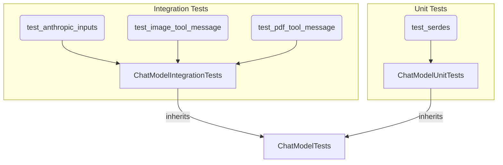

# chat_model_tests
This module provides base classes and specific test methods for both integration and unit testing of chat models, covering features like tool calling, structured output, and various message input formats.

<!-- DIAGRAM_JSON
{
  "nodes": [
    {"id": "ChatModelTests", "label": "ChatModelTests", "type": "class"},
    {"id": "ChatModelIntegrationTests", "label": "ChatModelIntegrationTests", "type": "class"},
    {"id": "test_anthropic_inputs", "label": "test_anthropic_inputs", "type": "method"},
    {"id": "test_image_tool_message", "label": "test_image_tool_message", "type": "method"},
    {"id": "test_pdf_tool_message", "label": "test_pdf_tool_message", "type": "method"},
    {"id": "ChatModelUnitTests", "label": "ChatModelUnitTests", "type": "class"},
    {"id": "test_serdes", "label": "test_serdes", "type": "method"}
  ],
  "edges": [
    {"source": "ChatModelIntegrationTests", "target": "ChatModelTests", "label": "inherits"},
    {"source": "ChatModelUnitTests", "target": "ChatModelTests", "label": "inherits"},
    {"source": "test_anthropic_inputs", "target": "ChatModelIntegrationTests", "label": "method_of"},
    {"source": "test_image_tool_message", "target": "ChatModelIntegrationTests", "label": "method_of"},
    {"source": "test_pdf_tool_message", "target": "ChatModelIntegrationTests", "label": "method_of"},
    {"source": "test_serdes", "target": "ChatModelUnitTests", "label": "method_of"}
  ],
  "groups": [
    {"id": "IntegrationTests", "label": "Integration Tests", "nodes": ["ChatModelIntegrationTests", "test_anthropic_inputs", "test_image_tool_message", "test_pdf_tool_message"]},
    {"id": "UnitTests", "label": "Unit Tests", "nodes": ["ChatModelUnitTests", "test_serdes"]}
  ]
}
-->
