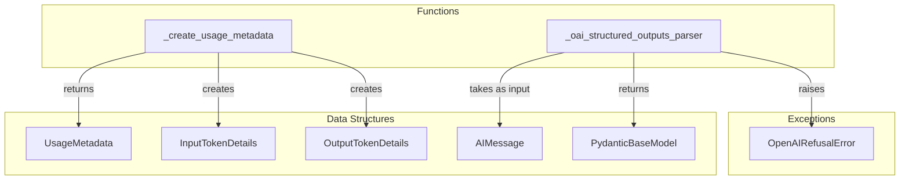

# chat_model_utilities
This module provides utility functions for processing outputs from OpenAI chat models, including generating detailed token usage metadata and parsing structured responses into Pydantic models.

<!-- DIAGRAM_JSON
{
    "nodes": [
        {
            "id": "_create_usage_metadata",
            "label": "_create_usage_metadata",
            "type": "function"
        },
        {
            "id": "_oai_structured_outputs_parser",
            "label": "_oai_structured_outputs_parser",
            "type": "function"
        },
        {
            "id": "UsageMetadata",
            "label": "UsageMetadata",
            "type": "data_structure"
        },
        {
            "id": "AIMessage",
            "label": "AIMessage",
            "type": "data_structure"
        },
        {
            "id": "PydanticBaseModel",
            "label": "PydanticBaseModel",
            "type": "data_structure"
        },
        {
            "id": "OpenAIRefusalError",
            "label": "OpenAIRefusalError",
            "type": "exception"
        },
        {
            "id": "InputTokenDetails",
            "label": "InputTokenDetails",
            "type": "data_structure"
        },
        {
            "id": "OutputTokenDetails",
            "label": "OutputTokenDetails",
            "type": "data_structure"
        }
    ],
    "edges": [
        {
            "source": "_create_usage_metadata",
            "target": "UsageMetadata",
            "label": "returns"
        },
        {
            "source": "_create_usage_metadata",
            "target": "InputTokenDetails",
            "label": "creates"
        },
        {
            "source": "_create_usage_metadata",
            "target": "OutputTokenDetails",
            "label": "creates"
        },
        {
            "source": "_oai_structured_outputs_parser",
            "target": "AIMessage",
            "label": "takes as input"
        },
        {
            "source": "_oai_structured_outputs_parser",
            "target": "PydanticBaseModel",
            "label": "returns"
        },
        {
            "source": "_oai_structured_outputs_parser",
            "target": "OpenAIRefusalError",
            "label": "raises"
        }
    ],
    "groups": [
        {
            "id": "Functions",
            "label": "Functions",
            "nodes": [
                "_create_usage_metadata",
                "_oai_structured_outputs_parser"
            ]
        },
        {
            "id": "Data Structures",
            "label": "Data Structures",
            "nodes": [
                "UsageMetadata",
                "AIMessage",
                "PydanticBaseModel",
                "InputTokenDetails",
                "OutputTokenDetails"
            ]
        },
        {
            "id": "Exceptions",
            "label": "Exceptions",
            "nodes": [
                "OpenAIRefusalError"
            ]
        }
    ]
}
-->
