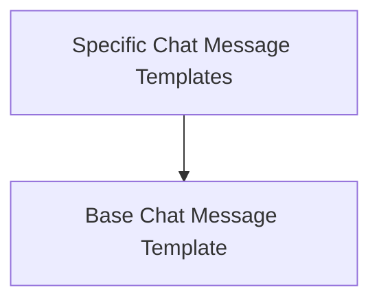

# Chat Prompt Templates Module

## Introduction

The `chat_prompt_templates` module provides foundational classes for creating various types of chat message prompt templates, including generic chat messages, AI-specific messages, and system messages. These templates are essential for structuring prompts sent to language models, ensuring that messages are correctly formatted and attributed to their respective roles.

## Architecture

This module is structured into two main sub-modules:

1.  **Base Chat Message Template**: Handles the generic creation of chat messages with a specified role and content.
2.  **Specific Chat Message Templates**: Provides specialized templates for AI and system messages, inheriting from a common base to define their specific message types.

These sub-modules work together to offer a flexible and extensible way to construct chat-based prompts.

<!-- DIAGRAM_JSON
{
    "direction": "TD",
    "nodes": [
        {"id": "base_chat_message_template", "label": "Base Chat Message Template", "type": "module", "link": "base_chat_message_template.md"},
        {"id": "specific_chat_message_templates", "label": "Specific Chat Message Templates", "type": "module", "link": "specific_chat_message_templates.md"}
    ],
    "edges": [
        {"source": "specific_chat_message_templates", "target": "base_chat_message_template"}
    ],
    "groups": []
}
-->

## Sub-modules

### [Base Chat Message Template](base_chat_message_template.md)

This sub-module defines the `ChatMessagePromptTemplate`, a versatile class for creating chat messages with a customizable role (e.g., "human", "ai", "system") and content. It handles the formatting of text into a `ChatMessage` object, allowing for dynamic content generation based on input arguments. This serves as a fundamental building block for more specialized message types.

### [Specific Chat Message Templates](specific_chat_message_templates.md)

This sub-module includes `AIMessagePromptTemplate` and `SystemMessagePromptTemplate`. These templates are specialized versions of a base message template, designed to generate messages specifically from the AI or as system instructions. They inherit common formatting capabilities and automatically set the appropriate message class, simplifying the creation of structured prompts for different conversational entities.